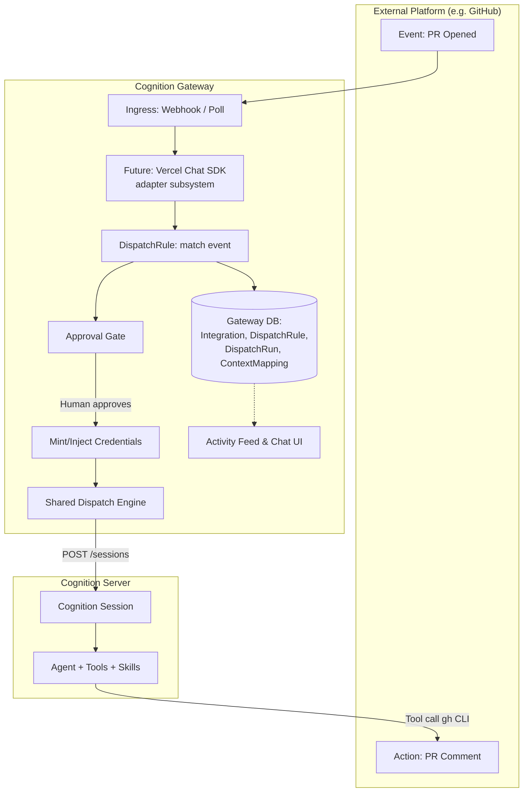
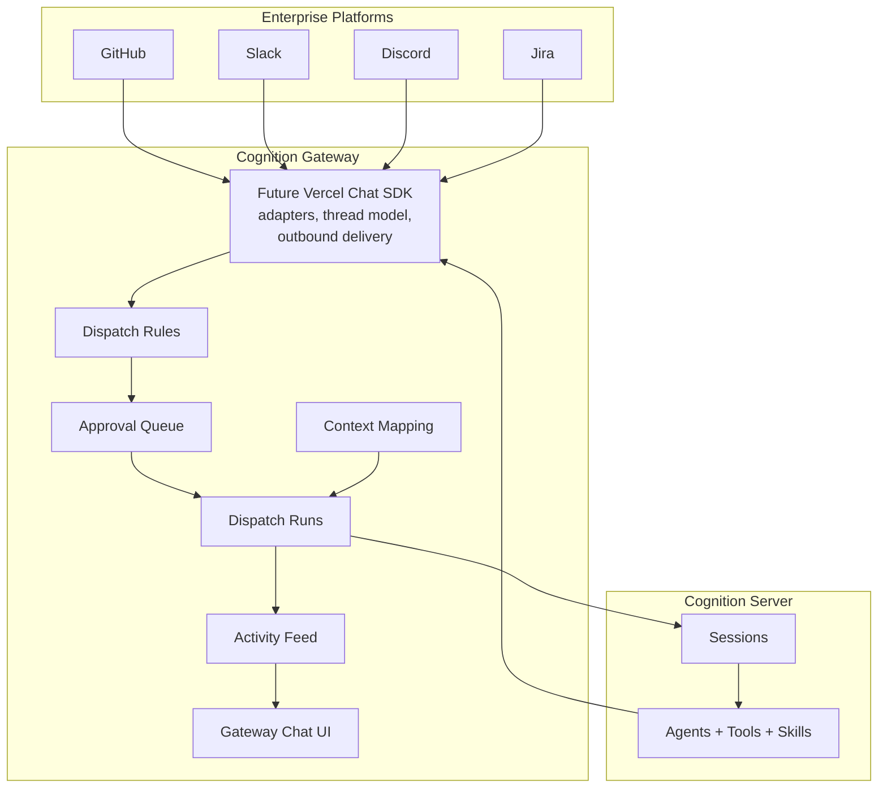
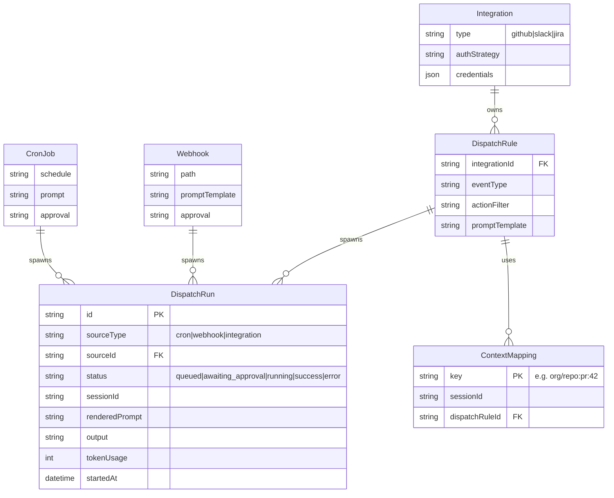
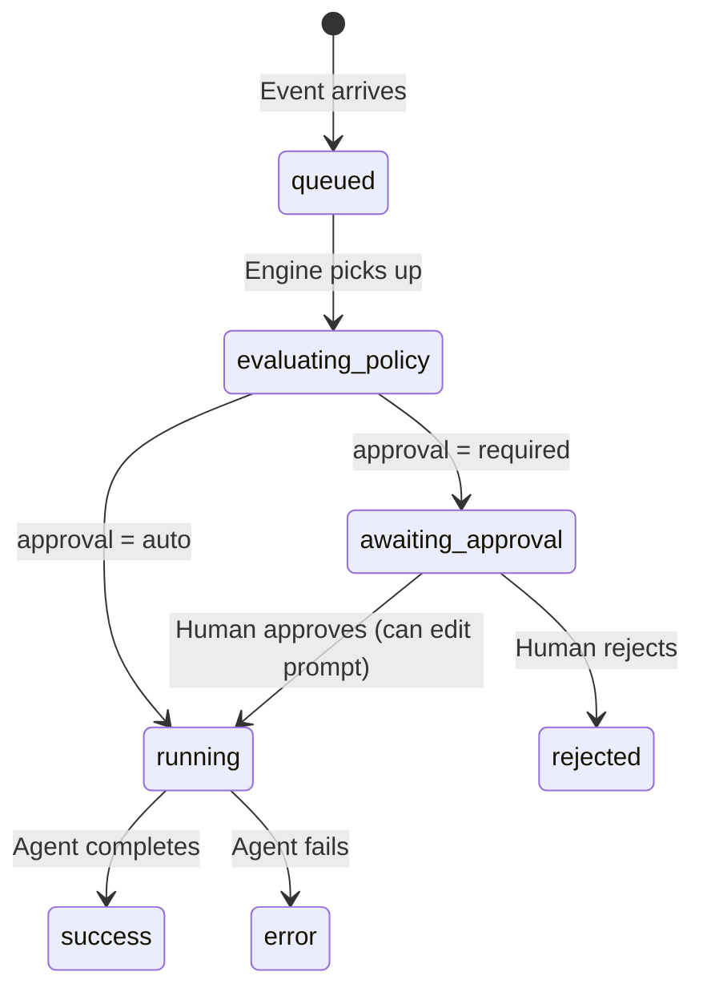

# Cognition Gateway: Future Guidance & Orchestration Architecture

**Category:** Architecture / Product Direction  
**Status:** Accepted Direction  
**Layer:** 1 (Data), 2 (Gateway Core), 3 (API), 4 (UI)  

This document synthesizes the various proposals around GitHub orchestration, webhooks, and cron jobs into a coherent future architecture for Cognition Gateway. It defines the product identity, the integration pattern for enterprise platforms, the unified dispatch engine, and the concrete migration path.

---

## 1. Product Identity: What Are We Building?

There are two distinct mental models for an AI agent platform:

**Model A: The Personal Assistant** (e.g., OpenClaw)
- **Flow:** Human sends message → Agent responds → Human reads
- **Identity:** A conversational assistant living on messaging platforms (Slack, WhatsApp, Discord)
- **Trust:** Single trusted operator, direct execution

**Model B: The Autonomous Control Plane** (Cognition Gateway)
- **Flow:** Enterprise event fires (PR opened) → Gateway routes to agent → Human optionally approves → Agent works on platform → Human monitors and steers
- **Identity:** An event-driven governance layer for autonomous agent workloads
- **Trust:** Multi-user team, audit trails, approval gates, layered autonomy

**Cognition Gateway is Model B.** It is not a chat bot that lives in Slack. It is a control plane where teams configure rules, approve sensitive actions, and observe reasoning traces while agents do work autonomously in external platforms like GitHub. The chat UI is not just for chatting — it is the "break-glass" governance interface where humans steer agents mid-task.

---

## 2. Architectural Principles

These principles define the long-term boundary between Cognition Gateway, Cognition Server, and external enterprise systems.

1. **Gateway is the control plane.** Its primary job is to decide when agents run, under what policies, with what human oversight.
2. **Cognition is the execution substrate.** Its primary job is to run sessions, stream reasoning, and expose tools and skills to agents.
3. **External platforms are contextual surfaces.** GitHub, Slack, Discord, Jira, and similar systems are where work is noticed, triggered, and observed, but not where deep agent governance lives.
4. **Human-in-the-loop is a first-class product feature.** Users must be able to inspect reasoning, approve or reject runs, and continue the same session interactively.
5. **Integrations must scale generically.** Gateway should support N+1 enterprise platforms through stable abstractions rather than one-off orchestration paths.
6. **Adapters are infrastructure, not product identity.** A future adoption of Vercel Chat SDK (`vercel/chat`) or a similar adapter layer is valuable if it reduces platform complexity, but Gateway remains a supervision-first control plane.
7. **Governance decisions happen only in Gateway.** External systems may notify, trigger, and receive agent work, but approvals, prompt review, and deep supervision stay in Gateway.

---

## 3. The Integration Pattern

To support N+1 enterprise apps (GitHub, Slack, Jira, PagerDuty), we establish a generic **Integration Pattern**.

This pattern assumes a near-term implementation where Gateway owns integration setup, inbound event handling, and outbound delivery. It also leaves room for a future internal adoption of **Vercel Chat SDK (`vercel/chat`)** or a similar adapter subsystem inside Gateway so that platform-specific thread, message, and formatting behavior can be normalized behind a shared layer.

### Core Principles

1. **Gateway owns the integration surface.** Gateway handles authentication, receives webhooks, manages thread and event normalization, and injects short-lived credentials into the agent session. The agent uses its own tools/skills (e.g., `gh` CLI) to actually interact with the platform.
2. **Layered filtering.** Gateway does cheap, coarse filtering (e.g., "only PR open events"). The agent does expensive, fine-grained filtering (e.g., "ignore PRs touching only markdown files").
3. **Session continuity.** Multiple events concerning the same entity (e.g., three pushes to the same PR) must route to the *same* Cognition session so the agent retains context.
4. **Gateway remains the supervision surface.** External systems are where work begins, is observed, and may notify humans that action is needed. Gateway is where humans inspect reasoning, approve runs, and steer the agent in depth.

### Architecture



---

## 4. Gateway-Owned Vercel Chat SDK Integration (Future Feature)

As the number of enterprise integrations grows, Gateway may benefit from incorporating **Vercel Chat SDK (`vercel/chat`)** as an internal adapter subsystem. This is a future feature, not a prerequisite for the dispatch architecture.

The purpose of this future integration is not to turn Gateway into a multi-channel assistant product. Its purpose is to reduce the cost of supporting N+1 enterprise platforms by normalizing inbound events, thread identity, outbound replies, formatting behavior, and auth strategies behind a shared adapter layer.

### Why `vercel/chat` belongs in Gateway

- It is primarily an **operator-facing integration surface**, not a pure runtime primitive.
- It is tightly coupled to **dispatch rules, approvals, activity feed, and human supervision**.
- It helps Gateway support external systems consistently without pushing product-facing integration complexity into Cognition core.

### What Gateway would use it for

**A future `vercel/chat` integration in Gateway should own:**
- integration adapters for GitHub, Slack, Discord, Jira, and similar systems
- normalized inbound event and thread models
- outbound delivery and reply abstraction
- auth strategy abstraction per platform
- platform capability detection (threading, formatting, editing, reactions, etc.)

**It should not own:**
- agent execution
- approval policy
- activity feed semantics
- audit policy
- Cognition session lifecycle

### Governance boundary

If Gateway adopts `vercel/chat`, external platforms may:
- trigger agent work
- receive summaries and result updates
- notify humans that approval is required
- link back into Gateway

External platforms should not:
- become approval surfaces
- allow prompt editing
- replace the Gateway activity feed or approval queue

This keeps `vercel/chat` in the role of an adapter subsystem rather than allowing it to redefine the product.

### Conceptual Model



### User Experience Principle

If this future primitive is added, the user experience should remain:

- **External platforms** are where work is noticed, triggered, and lightly nudged.
- **Gateway** is where agent work is governed, inspected, approved, and deeply steered.

When an approval is required, the preferred pattern is:
- the external platform receives a short "approval required" notification
- the notification links directly into the relevant Gateway approval screen
- the approval decision itself is made only in Gateway

That keeps Gateway aligned with its control-plane identity rather than drifting into an OpenClaw-style assistant that "lives" in every chat surface.

---

## 5. The Unified Dispatch Engine

Currently, cron jobs and webhooks have duplicate execution logic (`cron.ts` and `webhooks.ts`) and separate database models (`CronJobRun` vs `WebhookInvocation`).

We will unify the **Execution** side without forcing a premature abstraction on the **Trigger** side.

### The Model: Separate Triggers, Unified Runs



### Why this works:
1. **Durable Queue:** The engine just polls the `DispatchRun` table for `status: "queued"` using PostgreSQL `SKIP LOCKED`. No Redis needed.
2. **Unified Activity Feed:** The UI queries a single table (`DispatchRun`) to show all agent activity across all triggers.
3. **Unified Approval Queue:** The UI queries `DispatchRun WHERE status = "awaiting_approval"`.

---

## 5. Session Continuity & Approval Gates

### ContextMapping (Continuity)

When a GitHub PR is opened, the Gateway creates a session. When a user pushes a new commit to that PR an hour later, the Gateway must send that event to the *existing* session, not a new one.

- The `DispatchRule` defines a `contextKeyTemplate` (e.g., `{{repository.full_name}}:pull_request:{{pull_request.number}}`).
- When an event arrives, Gateway renders the key.
- If the key exists in `ContextMapping`, Gateway uses the existing `sessionId`. If not, it creates a new session and writes the mapping.

### Approval Gates

For sensitive actions (e.g., a PR touching `auth/**`), Gateway holds the run.



The human sees the pending approval in the UI, reads the rendered prompt, can edit the prompt to add constraints ("don't change the API signature"), and clicks Approve.

---

## 6. UI Wireframes

To make this concrete, here is how the new concepts manifest in the Gateway UI.

### Navigation Restructure
The sidebar is reorganized to separate governance (observing runs) from configuration (managing agents and integrations).

```text
┌──────────────────────────────────────┐
│ 👤 User Profile          [Settings]  │
├──────────────────────────────────────┤
│ CHAT                                 │
│ 💬 Sessions                          │
├──────────────────────────────────────┤
│ GOVERNANCE                           │
│ 📊 Activity Feed                     │
│ ✅ Approvals  [3]                    │
├──────────────────────────────────────┤
│ TRIGGERS                             │
│ ⏰ Cron Jobs                         │
│ 🌐 Webhooks                          │
│ 🐙 Integrations                      │
├──────────────────────────────────────┤
│ COGNITION                            │
│ 🤖 Agents                            │
│ 🧠 Models                            │
│ 🛠️ Tools & Skills                    │
│ ⚙️ Config                            │
├──────────────────────────────────────┤
│ ADMIN                                │
│ 👥 Users                             │
│ 📜 Audit Log                         │
└──────────────────────────────────────┘
```

### The Activity Feed
A unified view of all `DispatchRun` records, regardless of what triggered them.

```text
Activity Feed
[ All Triggers ▾ ] [ All Statuses ▾ ] [ Last 7 Days ▾ ]

STATUS    TRIGGER        AGENT            STARTED       DURATION
─────────────────────────────────────────────────────────────────
✅ Succ   PR #42         code-reviewer    10:24 AM      2m 14s
          (github)       Commented on 3 files.
                         [View Session ->]

⏳ Wait   PR #43         security-agent   09:15 AM      -
          (github)       Pending approval.
                         [Review ->]

✅ Succ   Weekly Triage  issue-triager    Mon 9:00 AM   45s
          (cron)         Closed 2 stale issues.
                         [View Session ->]

❌ Err    Deploy hook    deploy-bot       Mon 8:15 AM   12s
          (webhook)      Connection timeout.
                         [View Error ->]
```

### Integrations Page
If a future `vercel/chat` integration is added, the Integrations page becomes the setup and visibility layer for enterprise adapters.

```text
Integrations

[ Add Integration ]

TYPE      NAME              STATUS      AUTH             ACTIONS
────────────────────────────────────────────────────────────────────
GitHub    myorg             Connected   GitHub App       [Manage]
Slack     eng-workspace     Connected   Bot Token        [Manage]
Jira      product-cloud     Pending     OAuth            [Finish]
Discord   incident-server   Connected   Bot Token        [Manage]

GitHub / myorg
  - Repositories: 24
  - Inbound events: pull_request, issue_comment, workflow_run
  - Outbound delivery: comments, status updates
  - Last event received: 2 minutes ago
```

### Dispatch Rule Builder
Rules remain the user-facing abstraction even if integration adapters become more capable internally.

```text
New Dispatch Rule

Integration:   [ GitHub myorg ▾ ]
Event Type:    [ pull_request ▾ ]
Actions:       [ opened, synchronize ]
Filter:        [ repo matches myorg/* ]
Agent:         [ code-reviewer ▾ ]

Context Key Template
  {{repository.full_name}}:pull_request:{{pull_request.number}}

Approval Policy
  ( ) Auto-run
  (x) Require approval when files match: auth/**, infra/**

Prompt Template
┌─────────────────────────────────────────────────────────────┐
│ Review the pull request in {{repository.full_name}}.       │
│ Focus on correctness, tests, and security-sensitive paths. │
└─────────────────────────────────────────────────────────────┘

[ Save Rule ]
```

### The Approval Gate View
When a human clicks into a pending approval, they see the context and the exact prompt the agent is about to receive.

```text
Approval Required: PR #43 Review
Triggered by: GitHub (myorg/myrepo)
Agent: security-agent

CONTEXT
Event: pull_request.opened
Author: alice-dev
Files changed:
  - src/auth/oauth.ts
  - src/auth/middleware.ts

PROMPT PREVIEW
┌─────────────────────────────────────────────────────────────┐
│ Review the pull request #43 in myorg/myrepo. Pay special    │
│ attention to the OAuth flow changes. Verify that the state  │
│ parameter is still validated correctly.                     │
└─────────────────────────────────────────────────────────────┘
[Edit Prompt]

ACTIONS
[ Approve & Run ]  [ Reject ]
```

### External Approval Notification
External systems may notify humans that a run needs review, but they do not host the approval action itself.

```text
Slack / Discord / GitHub notification

Agent run requires approval

Source: GitHub PR #43
Agent: security-agent
Reason: files matched auth/**

Action required: open Gateway to review prompt and approve.

[ Open in Gateway ]
```

---

## 7. Migration Path

This is designed to be shipped incrementally. There is no timeline pressure, and backwards compatibility is not a strict requirement, but shipping in functional increments reduces risk.

**PR 1: Core Observability Fixes (Prerequisites)**
- Fix WebSocket notification event name mismatch (dots vs underscores).
- Add `output` and `tokenUsage` columns to `WebhookInvocation`.
- Add clickable session links in the notification bell.
- Add `userId` / scope header to cron and webhook session creation so they appear in the UI.

**PR 2: Dispatch Engine & Unified Runs**
- Add `DispatchRun` and `ContextMapping` models to Prisma.
- Extract shared execution logic from `cron.ts` and `webhooks.ts` into a new `dispatch.ts` engine.
- Have cron and webhooks spawn `DispatchRun` records.
- *Migration note: We can hard-migrate existing `CronJobRun` and `WebhookInvocation` data to `DispatchRun` and drop the old tables.*

**PR 3: PostgreSQL & Durable Queue**
- Migrate from SQLite to PostgreSQL (required for concurrent queueing).
- Implement `SKIP LOCKED` polling loop in the dispatch engine.
- Webhooks now enqueue a `DispatchRun` and return HTTP 202 immediately, rather than blocking on execution.

**PR 4: Approval Gates & Activity Feed**
- Add `approval` field to `CronJob` and `Webhook`.
- Build the unified Activity Feed page (querying `DispatchRun`).
- Build the Approval Queue page.
- Add WebSocket notifications for pending approvals.

**PR 5: First Enterprise Integration (GitHub)**
- Add `Integration` and `DispatchRule` models.
- Implement GitHub webhook ingress and event normalization.
- Implement credential injection (passing the PAT or App token to the agent session).

**PR 6: Future Chat SDK Primitive Inside Gateway**
- Evaluate and, if appropriate, incorporate `vercel/chat` as a shared adapter layer for enterprise platforms.
- Normalize thread, event, and outbound delivery semantics across integrations.
- Move platform-specific formatting and reply behavior behind the adapter interface.
- Add external "approval required" notifications that deep-link back into Gateway.
- Keep `DispatchRule`, `DispatchRun`, approvals, and activity feed as the user-facing orchestration layer.

---

## 8. Required Cognition Server Capabilities

For this architecture to work securely and efficiently, the Cognition server API requires four non-breaking additions. (These should be proposed to the Cognition team immediately).

| Capability | Why Gateway Needs It |
|---|---|
| **`SessionConfig.env`** | Gateway must inject short-lived platform credentials (e.g., GitHub installation tokens) into the agent's sandbox per-run. These must be opaque secrets not logged or returned in the API. |
| **`MessageCreate.callback_url`** | For long-running agents, Gateway shouldn't hold an SSE connection open for 10 minutes. Cognition should POST a completion payload to Gateway when done. |
| **`SessionCreate.metadata`** | Gateway needs to tag sessions with `workflow_id` and `repository` for correlation in external observability tools. |
| **`GET /sessions?metadata.*`** | Gateway needs to query sessions by metadata to implement robust reconciliation loops. |

---

## 9. Key User Stories

These stories define the target experience once the architecture is complete.

1. **Autonomous PR Review with Human Discussion**
   > As a developer, I want an agent to automatically review my pull requests when opened. I want to open the agent's session in Gateway, ask questions about its reasoning, and instruct it to approve and merge when I'm satisfied.

2. **Approval Gate on Sensitive Code**
   > As a team lead, I want agent dispatch to be held for human approval when a PR touches authentication code, so that I can review and edit the agent's instructions before it acts.

3. **Session Continuity**
   > As a developer, I want subsequent pushes on the same PR to resume the existing agent session rather than starting fresh, so the agent retains context from its prior review and my earlier instructions.

4. **Unified Activity Feed**
   > As an admin managing multiple repos, I want a single activity feed showing all agent runs (GitHub triggers, cron schedules, webhooks) filterable by status, so I can monitor all agent activity from one place.

5. **Self-Recovery from CI**
   > As a developer, I want an agent to automatically diagnose CI failures on my PRs. If the fix is simple, the agent pushes a commit. If complex, it notifies me in Gateway so we can discuss the fix interactively.

6. **Normalized Enterprise Adapters**
   > As a Gateway developer, I want GitHub, Slack, Discord, Jira, and future platform events normalized into a common internal model, so that the dispatch engine and approval model do not need platform-specific orchestration code.

7. **External Thread to Gateway Session Linkage**
   > As a user, I want a PR thread, Slack thread, or Discord thread to link to a Cognition session in Gateway, so that I can move from lightweight external interaction into deep inspection and steering without losing context.

8. **Shared Outbound Delivery Layer**
   > As a Gateway admin, I want agent results to be posted back to enterprise platforms through a common adapter layer, so that outbound delivery remains consistent as Gateway supports additional integrations.

9. **Approval Required Notification**
   > As a reviewer, I want to receive an external alert when an agent run needs approval, so that I know action is required without polling Gateway.

10. **Gateway-Only Approval Decision**
   > As a reviewer, I want external notifications to link directly to the relevant approval screen in Gateway, so that I can review the prompt and make the governance decision in the proper supervision surface.
