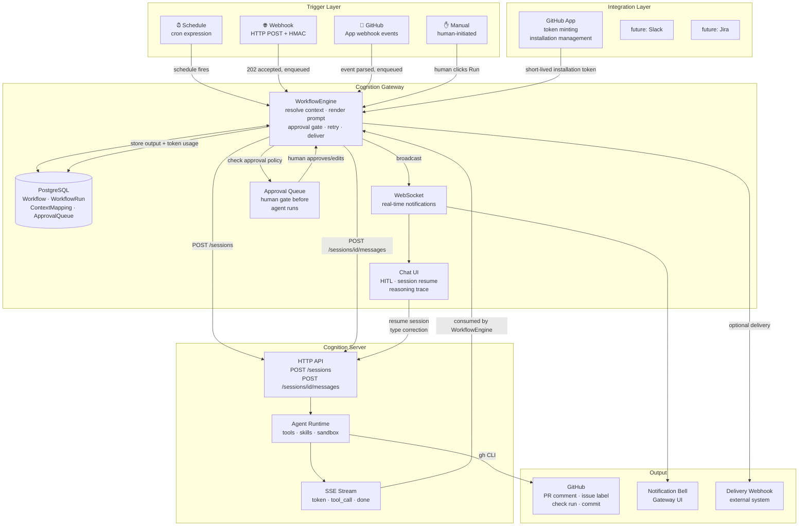
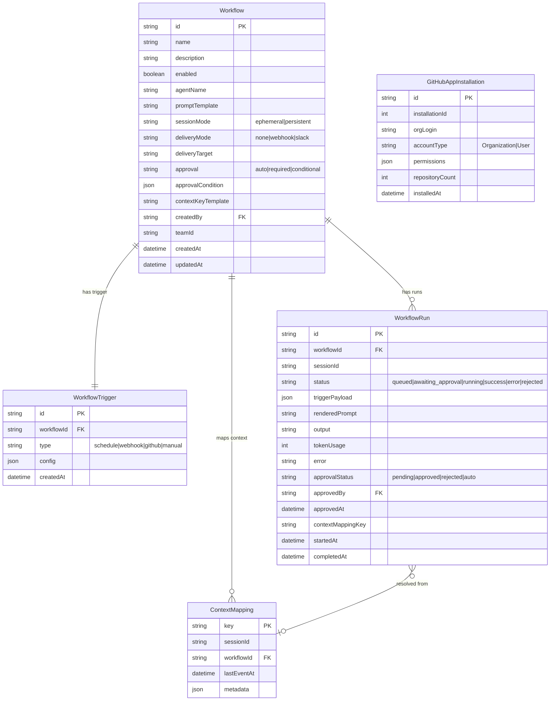
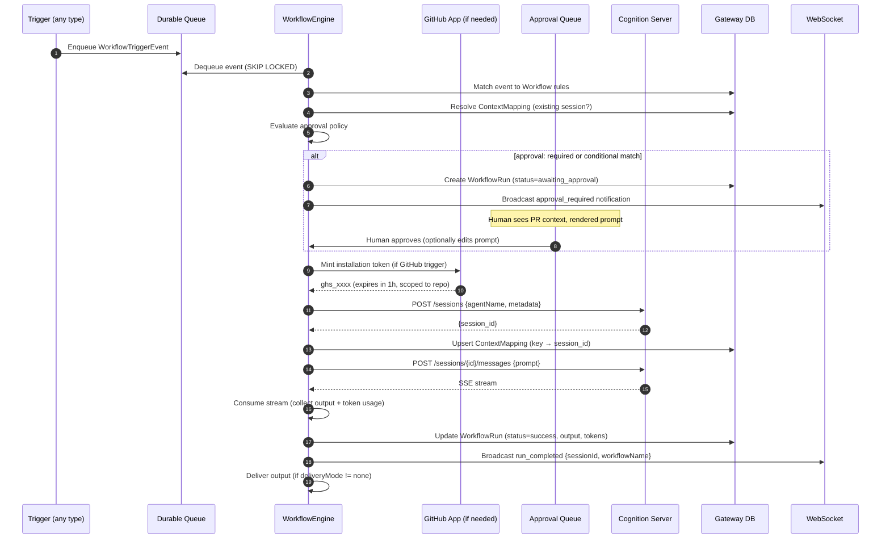
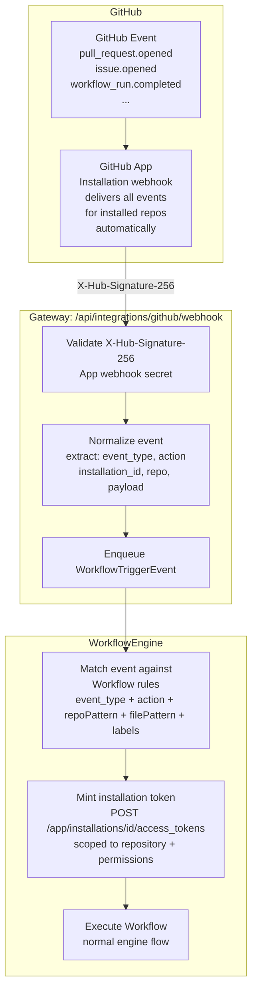
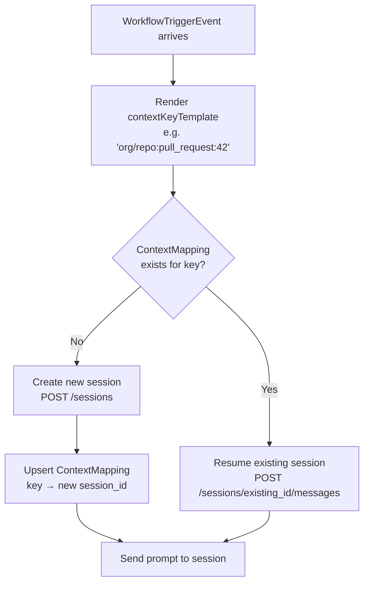
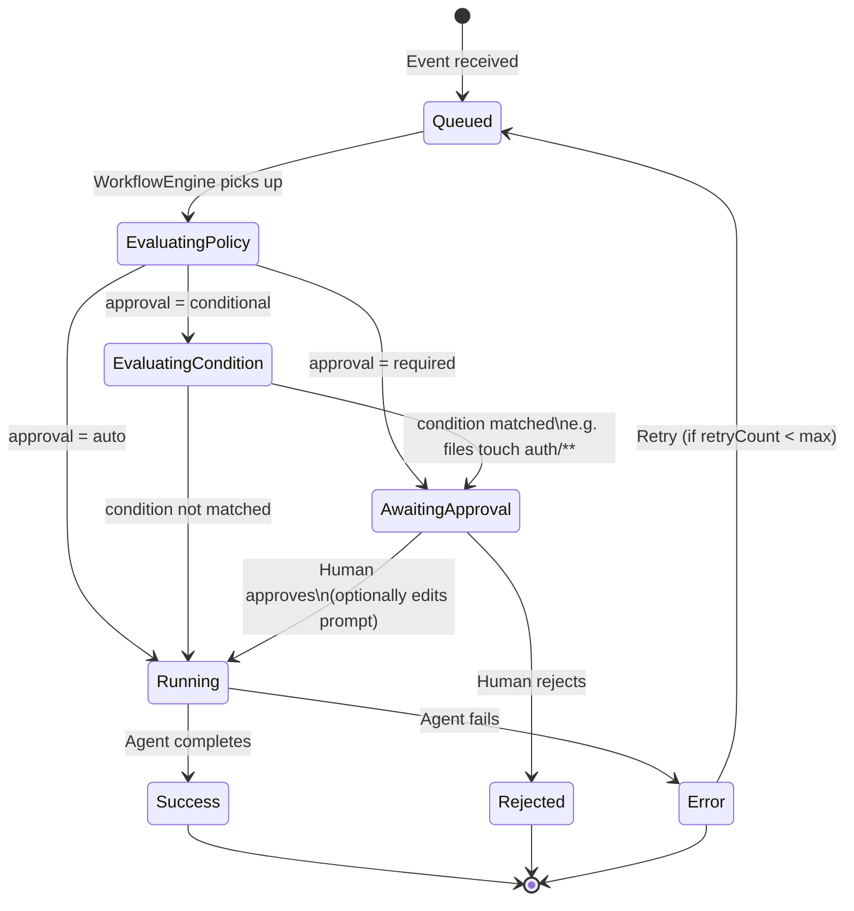
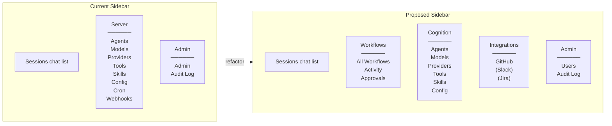
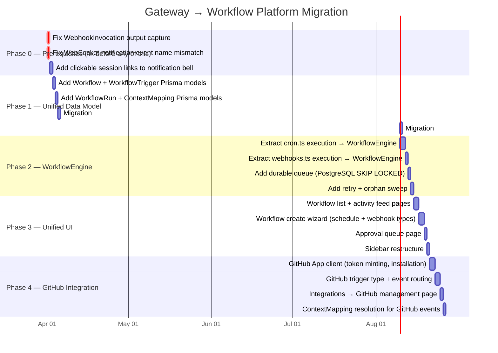

# RFC: Gateway as a Workflow Platform — Unifying Cron, Webhooks, and GitHub Orchestration

**Category:** Architecture / Product Direction  
**Status:** Proposal — open for discussion with Cognition Gateway team  
**Layer:** 1 (Data), 2 (Gateway Core), 3 (API), 4 (UI)  
**Related:**
- [Option A: GitHub Actions Direct to Cognition](./github-actions-direct-to-cognition.md)
- [Option B: Gateway Webhook Orchestration](./gateway-webhook-orchestration.md)
- [RFC: Workspace Sessions](./workspace-sessions-design.md)

---

## Context

This RFC responds to the two GitHub orchestration proposals and the Gateway team's framing of the app as "a detached frontend for any Cognition server." Both proposals are well-reasoned, but they expose a deeper architectural question that neither answers directly:

> **Is Gateway a generic Cognition chat UI with automation bolt-ons, or is it a control plane for Cognition-powered workflows?**

The answer to that question determines not just how to implement GitHub orchestration, but the entire long-term product surface of the Gateway.

This document argues for the latter, proposes a concrete architectural direction, identifies what Cognition itself needs to support this vision, and outlines a migration path from the current state.

---

## The Core Problem with Both Proposals

### Option A (GitHub Actions → Cognition Direct)

Option A is operationally appealing — GitHub already has the event bus, retry logic, secret management, and audit trail. For a solo builder validating the concept, it works.

But it has two structural problems at enterprise scale:

1. **No human-in-the-loop path.** When the agent produces a review, there is no supported way for a human to see the agent's full reasoning trace, inject corrections, or steer the agent before it acts on a security-sensitive PR. GitHub Actions logs show curl output. The agent's thinking is invisible.

2. **No session continuity.** The proposed workaround — embedding session IDs in PR description HTML comments — is fragile by design. A PR body edit, a template overwrite, or a bot that formats PR descriptions wipes the continuity state. At 50+ repos, this fails constantly.

### Option B (Gateway Webhooks)

Option B solves the HITL problem. The Gateway chat UI can already open any Cognition session and resume it interactively. The audit trail, WebSocket notifications, and session management are in place.

But it has one critical infrastructure gap and one product framing gap:

1. **Missing infrastructure**: `WebhookInvocation` currently discards the agent's output (the SSE stream is consumed but not persisted to the invocation record). The PR→session mapping doesn't exist. The notification bell links aren't clickable. These are 3–4 days of fixes, but they must be treated as prerequisites, not enhancements.

2. **Framing gap**: The Gateway currently treats cron jobs and webhooks as two independent automation features sitting alongside "Agents," "Models," and "Config" in a flat Server section. There is no unifying concept. Adding GitHub orchestration as a third mechanism (alongside `CronJob` and `Webhook`) produces a product that becomes increasingly hard to reason about as more trigger types are added.

---

## The Proposed Direction: Unified Workflow Platform

### The Conceptual Shift

| Current identity | Proposed identity |
|---|---|
| "A detached frontend for any Cognition server" | "A control plane for Cognition-powered workflows, with a built-in chat interface" |

Under the new model, **everything is a Workflow** — a named, configurable rule that maps a trigger to an agent action, with session continuity policy, approval gates, and output delivery. The existing primitives become instances of this model:

| Current | As a Workflow |
|---|---|
| CronJob | Workflow with a `schedule` trigger |
| Webhook | Workflow with a `webhook` trigger |
| Chat session | Workflow with a `manual` (human) trigger |
| GitHub PR review | Workflow with a `github` trigger |

The chat UI is not replaced — it becomes the primary delivery surface for Workflow output and the HITL interface for any running session, regardless of what triggered it.

---

## Architecture

### System Overview



---

### The Three-Layer Architecture

The key insight that both Option A and Option B miss is that event ingestion and orchestration must be separated. They have different availability and latency requirements.

```mermaid
flowchart LR
    subgraph L1["Layer 1: Ingestion (Stateless, <100ms)"]
        I1[Validate HMAC]
        I2[Parse event type + action]
        I3[Normalize → WorkflowTriggerEvent]
        I4[Enqueue to durable queue]
        I5[Return 202 immediately]
    end

    subgraph L2["Layer 2: Orchestration (Stateful, seconds)"]
        O1[Match event to Workflow rules]
        O2[Resolve ContextMapping\nfind existing session]
        O3[Evaluate approval policy]
        O4[Mint credentials\nGitHub installation token]
        O5[Render prompt template]
        O6[Dispatch to Cognition]
        O7[Consume SSE · persist output]
        O8[Deliver output · notify humans]
    end

    subgraph L3["Layer 3: Execution (Isolated)"]
        E1[Cognition Server\nstateless HTTP + SSE]
        E2[Agent Runtime\ngh CLI · tools · sandbox]
    end

    L1 -->|WorkflowTriggerEvent\ndurable, at-least-once| L2
    L2 -->|POST /sessions\nPOST /sessions/id/messages| L3
    L3 -->|SSE stream| L2
```



**Why the queue matters:** In the current Gateway implementation, `processWebhookInBackground()` is a `void` fire-and-forget function. If the Gateway pod crashes after returning 202 but before the background processing completes, the event is silently lost. A durable queue (PostgreSQL `SKIP LOCKED` is sufficient — no Redis required) makes every trigger event durable and retryable before an orchestration worker picks it up.

---

### Unified Data Model

The current `CronJob` and `Webhook` models are 80% identical. The proposed `Workflow` model unifies them:



**`ContextMapping`** is the table that solves session continuity robustly, without embedding state in PR descriptions or labels:

```
key: "org/repo:pull_request:42"  →  sessionId: "sess_abc123"
key: "org/repo:issue:17"         →  sessionId: "sess_def456"
```

The key template is configured per Workflow: `{{repository.full_name}}:{{event_type}}:{{pull_request.number}}`. When a new event arrives for the same PR, the engine resolves the existing session and resumes it instead of creating a new one.

---

### The WorkflowEngine

The `WorkflowEngine` is the central orchestration component — a pure Node.js module in `src/lib/gateway/` that replaces the current independent `cron.ts` and `webhooks.ts` execution logic.



**Key design decisions:**

- **No fire-and-forget.** The engine holds the SSE connection and persists output before broadcasting. Pod crashes during execution result in a `status=error` run (on restart, a sweep finds orphaned `status=running` runs older than N minutes and marks them failed for retry).
- **Credential isolation.** GitHub installation tokens are minted per-run, scoped to the specific repository, and never stored — only held in memory for the duration of the run. When the run completes, the token is discarded.
- **Prompt preview before approval.** The rendered prompt is stored on the `WorkflowRun` before the approval gate, so the human reviewing the request sees exactly what the agent will be told.

---

### Trigger Type: GitHub App

The GitHub trigger is implemented as a plugin to the trigger registry. It registers a webhook endpoint and provides the event normalization logic.



**One GitHub App installation = zero per-repo configuration.** Unlike Option B's current generic webhook model (which requires manually configuring a webhook URL in each repo's Settings), a GitHub App webhook delivers events for every repo that installs the App automatically. This is the correct model for 50+ repos.

**Event routing rules** are evaluated per-event against all active GitHub-triggered Workflows:

| Rule field | Example | How it filters |
|---|---|---|
| `event_type` | `pull_request` | Exact match on `X-GitHub-Event` header |
| `action` | `["opened", "synchronize"]` | Match on `payload.action` |
| `repoPattern` | `myorg/*` | Glob match on `repository.full_name` |
| `filePattern` | `["**/auth/**", "**/.env*"]` | Match against changed files in PR diff (requires extra API call) |
| `labelFilter` | `["!skip-review"]` | Label presence/absence on issue or PR |
| `authorFilter` | `["!dependabot[bot]"]` | Exclude bot authors |

Multiple Workflows can match the same event (e.g., "PR Review" and "Security Review" both fire on `pull_request.opened`). Each produces an independent `WorkflowRun`.

---

### Session Continuity

The `contextKeyTemplate` field on a Workflow defines how the engine determines whether an event should resume an existing session or start a new one.



For a GitHub PR review workflow with `contextKeyTemplate: "{{repository.full_name}}:pull_request:{{pull_request.number}}"`:

- `pull_request.opened` on PR #42 → key `org/repo:pull_request:42` → no mapping → create session, store mapping
- `pull_request.synchronize` on PR #42 → key `org/repo:pull_request:42` → mapping found → resume session with full prior context
- `issue_comment.created` on PR #42 (when `@agent` is mentioned) → same key → same session, same context
- `pull_request.closed` on PR #42 → session completes, mapping retained for audit

This replaces hidden PR metadata, labels, and external KV stores with a first-class Gateway DB table that is queryable, auditable, and survives PR body edits.

---

### Approval Gates

The approval system sits between event ingestion and agent dispatch. It is the enterprise-critical feature that makes the Gateway the correct control plane for sensitive agent actions.



The human-facing Approvals queue shows:
- The event that triggered the run (PR title, author, changed files)
- The rendered prompt the agent will receive
- An "Edit prompt" affordance (for injecting additional context before approval)
- Approve / Reject actions

This is impossible with GitHub Actions (Option A) — there is no approval gate in the Actions trigger path.

---

### Gateway UI: Navigation Restructure

The current flat "Server" nav section conflates agent configuration, model management, and automation triggers. The proposed structure separates concerns cleanly:



Cron and webhook management disappear as standalone pages. They become Workflow creation forms with `schedule` or `webhook` trigger types selected. The **Integrations** section is the new surface where platform connections are configured (GitHub App credentials, Slack OAuth, etc.) — distinct from agent configuration.

---

## What This Means for Cognition Server

This architecture surfaces several gaps in Cognition's current API. These are proposed as additions to the Cognition roadmap. Each is consistent with Cognition's mission (batteries-included AI backend) and the 7-layer architecture.

### 1. Environment Variable Injection into Agent Sandbox

**The need:** The GitHub integration mints a short-lived installation token per workflow run. This token must be available inside the agent's execution environment as `GITHUB_TOKEN` so that `gh` CLI calls succeed. Currently there is no mechanism to pass per-session environment variables into the sandbox.

**Proposed addition to `SessionConfig`:**

```python
class SessionConfig(BaseModel):
    # ... existing fields ...
    env: dict[str, SecretStr] | None = None
    """Per-session environment variables injected into the agent sandbox.
    Values are SecretStr and never logged or included in API responses.
    Scoped to the session lifetime only.
    """
```

**API shape:**
```json
POST /sessions
{
  "agent_name": "code-reviewer",
  "config": {
    "env": {
      "GITHUB_TOKEN": "ghs_xxxx"
    }
  }
}
```

**Security properties to maintain:**
- Values are `SecretStr` — never appear in `GET /sessions/{id}` responses or logs
- Env vars are injected at sandbox creation time, not persisted to the DB
- Scoped to the session; a new session gets no env vars by default

This keeps the security model clean: the Gateway mints the token, passes it as an opaque secret, and Cognition injects it without ever knowing what it is.

---

### 2. Completion Callback (Webhook on Done)

**The need:** The WorkflowEngine currently must hold an SSE connection open for the entire duration of the agent run in order to capture the `done` event and token usage. For long-running agents (code review on a large PR, CI failure diagnosis), this means the orchestration worker holds a connection for minutes. At scale with many concurrent workflows, this is a significant resource burden.

**Proposed addition to `MessageCreate`:**

```python
class MessageCreate(BaseModel):
    content: str
    # ... existing fields ...
    callback_url: AnyHttpUrl | None = None
    """If provided, Cognition POSTs to this URL when the agent run completes.
    The POST body is a CompletionCallback payload. The SSE stream is still
    available for callers that prefer it.
    """
```

**Callback payload:**
```json
POST {callback_url}
{
  "session_id": "sess_abc123",
  "message_id": "msg_xyz",
  "status": "done",
  "output": "The review has been posted to the PR.",
  "token_usage": { "input": 1840, "output": 412 },
  "model": "claude-sonnet-4-5",
  "completed_at": "2026-03-21T12:34:56Z"
}
```

The Gateway registers a per-run callback URL (scoped to the Gateway's own internal handler), receives the completion event, and updates the `WorkflowRun` record. No persistent SSE connection required.

This is a fire-and-deliver pattern already familiar from Stripe webhooks, GitHub Actions, and similar systems.

---

### 3. Session Metadata

**The need:** Workflow runs need to carry contextual metadata through the full lifecycle — workflow name, trigger type, repo, PR number, run ID. Today, only `title` exists on a session, which is a human-readable string.

**Proposed addition to `SessionCreate`:**

```python
class SessionCreate(BaseModel):
    title: str | None = None
    agent_name: str | None = None
    config: SessionConfig | None = None
    workspace_path: str | None = None
    metadata: dict[str, str] | None = None
    """Arbitrary key-value metadata attached to the session.
    Returned in GET /sessions/{id} responses. Not interpreted by Cognition.
    Intended for use by orchestration layers (Gateway, CI systems) to
    correlate sessions with external resources.
    """
```

**Example:**
```json
POST /sessions
{
  "agent_name": "code-reviewer",
  "title": "PR #42 review",
  "metadata": {
    "workflow_id": "wf_pr_review",
    "workflow_run_id": "run_abc123",
    "trigger_type": "github",
    "repository": "myorg/myrepo",
    "pull_request_number": "42"
  }
}
```

This metadata flows through to `GET /sessions` (for filtering) and observability tooling (OTEL spans, Prometheus labels), without Cognition needing to understand what any of the values mean.

---

### 4. Session Filtering by Metadata

**The need:** The Gateway needs to query "does a session already exist for PR #42 in myorg/myrepo?" without fetching all sessions. This supports the ContextMapping reconciliation path (fallback when a mapping record is missing but the session was created).

**Proposed addition to `GET /sessions`:**

```
GET /sessions?metadata.repository=myorg/myrepo&metadata.pull_request_number=42
```

Metadata keys become queryable filters. Cognition adds a simple JSON field index on the sessions table. This is additive, not breaking.

---

### Summary of Cognition Changes

| Change | Layer | Breaking? | Effort |
|---|---|---|---|
| `SessionConfig.env` — per-session sandbox env vars | Layer 1 (models), Layer 3 (execution) | No | Medium |
| `MessageCreate.callback_url` — completion webhook | Layer 6 (API) | No | Small |
| `SessionCreate.metadata` — arbitrary KV on session | Layer 1 (models), Layer 6 (API) | No | Small |
| `GET /sessions?metadata.*` filtering | Layer 6 (API), Layer 2 (persistence) | No | Small |

None of these require breaking changes. All are additive. All align with the mission of making an agent definition sufficient to generate a complete backend — in this case, an orchestration-friendly backend that can be called from a workflow engine without requiring persistent connections or session ID bookkeeping in external systems.

---

## Migration Path from Current Gateway State

The migration is phased to avoid a big-bang rewrite and to preserve the existing cron/webhook functionality throughout.



**Total estimated effort: 15–18 working days.**

Phases 0 through 3 deliver a materially better Gateway for all users regardless of whether they use GitHub. Phase 4 is the GitHub-specific work. The phases can be shipped independently.

---

## What This Is Not

To be clear about scope boundaries:

- **Not a full workflow DAG engine.** There is no multi-step chaining, branching, or parallelism at the workflow level. Each Workflow is a single prompt→agent→output unit. Chaining (agent A's output feeds agent B) belongs in the agent runtime (subagents, multi-agent graphs) — a Cognition concern, not a Gateway concern.

- **Not a replacement for GitHub Actions.** For teams that want agent activity to feel fully native to GitHub (visible in Actions runs, using per-repo YAML configuration, relying on `GITHUB_TOKEN` auto-provisioning), Option A remains valid. The two models can coexist: Actions for simple autonomous workflows, Gateway for workflows requiring human oversight.

- **Not a multi-tenant SaaS product.** The RBAC, per-team resource isolation, and billing metering that a true multi-tenant SaaS requires are out of scope. The Gateway's trust model (authenticated users operate against a shared Cognition server with scope-header isolation) remains unchanged.

---

## Open Questions

1. **Durable queue backend**: PostgreSQL `SKIP LOCKED` is sufficient for moderate concurrency and eliminates an external dependency. At very high event volumes (thousands of events/minute), Redis Streams or a cloud queue (SQS, Cloud Pub/Sub) would be appropriate. What is the expected event throughput for the initial deployment?

2. **GitHub App vs. PAT**: This proposal requires a GitHub App for the `github` trigger type. A PAT-based fallback would reduce setup friction for small teams. Should the `github` trigger support both, or require a GitHub App?

3. **PostgreSQL migration**: The current schema is SQLite. Phase 2 adds a durable queue that benefits significantly from PostgreSQL's `SKIP LOCKED` semantics and concurrent writers. Should the PostgreSQL migration (Phase 4 in the current ROADMAP) be pulled forward to Phase 1 of this work?

4. **Approval notifications**: The approval gate requires that someone is watching the Gateway UI (or receives a notification) within a reasonable time window. What is the expected notification path? WebSocket bell alone, or email/Slack integration for time-sensitive approvals?

5. **`contextKeyTemplate` default for manual triggers**: When a human creates a session via the chat UI, should it automatically populate a `ContextMapping`? This would allow a human to start a conversation about a PR, and subsequent automated runs for the same PR to resume that conversation — merging the chat and workflow paths into a single session.

---

## Related Discussion

- [Option A: GitHub Actions Direct to Cognition](./github-actions-direct-to-cognition.md)
- [Option B: Gateway Webhook Orchestration](./gateway-webhook-orchestration.md)
- [RFC: Workspace Sessions](./workspace-sessions-design.md)
