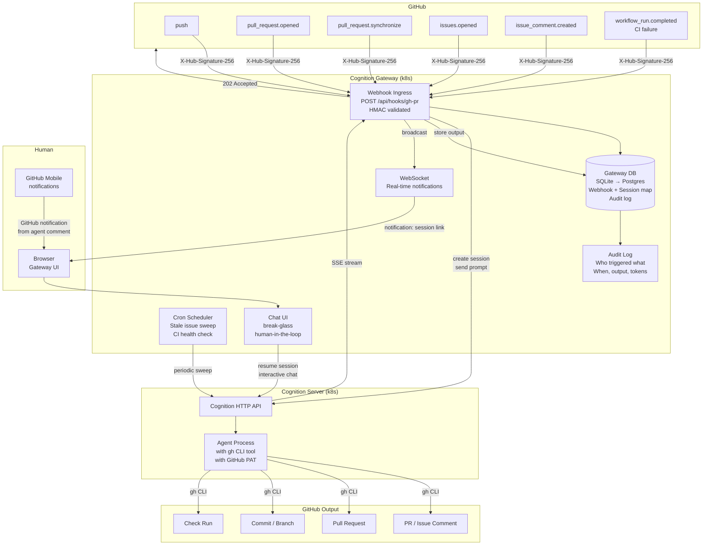
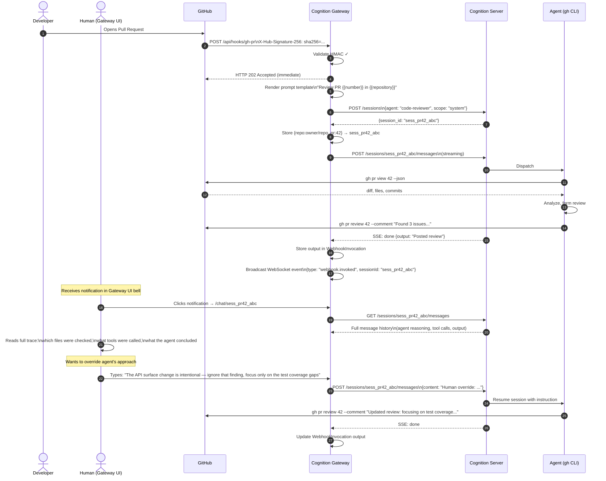
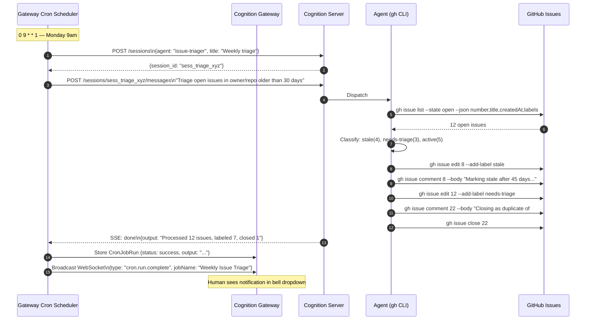
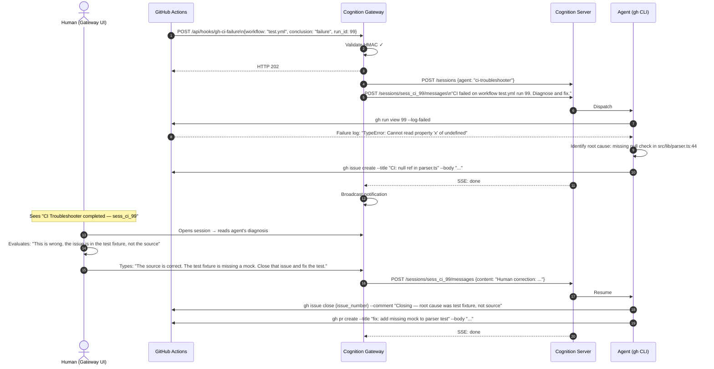
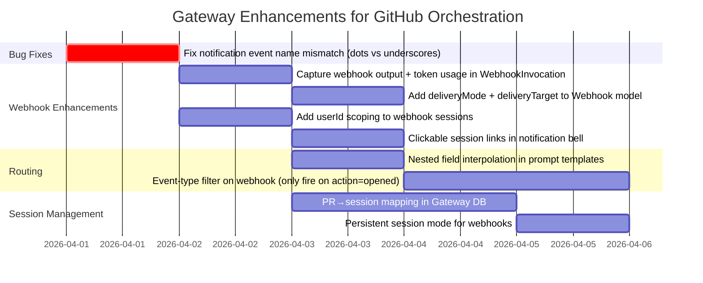
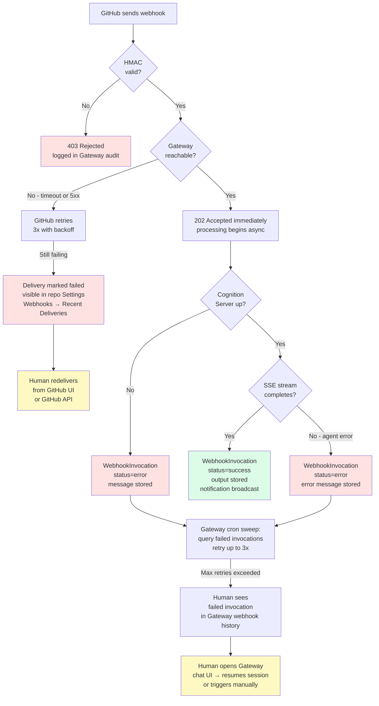
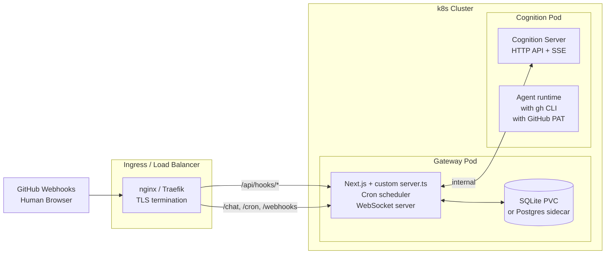

# RFC: GitHub-Driven Agent Orchestration via Gateway Webhooks (Human-in-the-Loop Control Plane)

**Category:** Architecture / Orchestration
**Status:** Proposal — open for discussion
**Related:** [Option A: GitHub Actions Direct to Cognition](./github-actions-direct-to-cognition.md)

---

## Overview

This discussion proposes using **Cognition Gateway as the primary orchestration layer** for autonomous agent workflows on GitHub projects. GitHub sends webhook events to Gateway; Gateway dispatches agents to Cognition Server; agents use `gh` CLI to interact with GitHub. The Gateway UI provides a human-in-the-loop break-glass interface — a human can open any agent session, observe the full reasoning trace, inject instructions, and take over when needed.

The core premise: Cognition Gateway already has the webhook ingress, HMAC validation, session management, audit trail, and chat UI to serve as a control plane. The missing pieces (webhook output capture, notification wiring, session discoverability) are fixable gaps, not architectural problems.

---

## Architecture



---

## Sequence: PR Review with Human Takeover



---

## Sequence: Stale Issue Sweep (Cron-Triggered)



---

## Sequence: Failed CI — Human Decides Whether to Engage



---

## Gateway Configuration: Webhook Setup

Each GitHub event type maps to a named webhook in Gateway. The prompt template interpolates payload fields using `{{field}}` syntax.

```
Gateway Webhook Registry
─────────────────────────────────────────────────────────
Name             Path                  Agent             Secret
──────────────────────────────────────────────────────────────
gh-pr-review     gh-pr-review          code-reviewer     ••••••••
gh-issue-opened  gh-issue-opened       issue-triager     ••••••••
gh-ci-failure    gh-ci-failure         ci-troubleshooter ••••••••
gh-discussion    gh-discussion         community-bot     ••••••••
─────────────────────────────────────────────────────────
```

**GitHub Repo Webhook Configuration:**

```
Payload URL:     https://gateway.your-domain.com/api/hooks/gh-pr-review
Content type:    application/json
Secret:          (matches Gateway webhook secret)
Events:          Pull requests
```

**Prompt template example (PR review):**

```
A pull request event was received.
Action: {{action}}
PR title: {{pull_request.title}}
Repository: {{repository.full_name}}
Author: {{pull_request.user.login}}
Base branch: {{pull_request.base.ref}}
Head branch: {{pull_request.head.ref}}

Full payload: {{body}}

Review this pull request. Use gh CLI to read the diff, analyze the changes,
and post a detailed inline review. Flag security issues, missing tests,
and breaking API changes.
```

> **Note:** The current Gateway prompt template only supports top-level `{{field}}` interpolation. Nested fields like `{{pull_request.title}}` require a small enhancement to the template renderer, or the agent can be instructed to parse `{{body}}` (the full JSON payload) directly.

---

## Required Gateway Enhancements

The following gaps must be addressed before this model is production-ready. All are small-scope fixes — they are wiring issues, not architectural rewrites.



| Priority | Enhancement | Effort | Blocks |
|---|---|---|---|
| **P0 — Bug** | Fix WebSocket notification event name mismatch (dots vs underscores) | 1 hour | All notifications |
| **P0** | Capture webhook output + token usage in `WebhookInvocation` | 3 hours | Observability, delivery |
| **P0** | Add `userId` scoping to webhook/cron sessions | 3 hours | Session discoverability |
| **P0** | Clickable session links in notification dropdown | 2 hours | HITL break-glass flow |
| **P1** | Nested field interpolation in prompt templates (`{{pull_request.title}}`) | 2 hours | Rich prompt context |
| **P1** | Webhook result delivery (add `deliveryMode`/`deliveryTarget` to Webhook model) | 4 hours | Agent-to-external delivery |
| **P2** | Event-type filter on webhook payload (only trigger on `action: "opened"`) | 1 day | Noise reduction |
| **P2** | PR→session mapping in Gateway DB | 1 day | Session continuity across events |
| **P2** | Persistent session mode for webhooks | 4 hours | Multi-turn PR conversations |

**Total estimated effort: ~3–4 days**

---

## Failure Modes and Recovery



**Reconciliation sweep (cron-based backfill):**

A Gateway cron job running every 15 minutes queries for open PRs/issues that should have received agent attention but have no linked session. This provides eventual consistency when webhook delivery fails:

```
Every 15 minutes:
  → gh issue list --label needs-triage --json number
  → For each issue with no agent comment in last 24h:
      → Trigger issue-triager agent
```

This is the **poll-based safety net** — real-time responsiveness from webhooks, reliability from polling.

---

## Pros and Cons

### Advantages

| Advantage | Why It Matters |
|---|---|
| **Centralized control plane** | All agent activity across all repos visible in one Gateway audit log and UI |
| **Human-in-the-loop native** | Gateway chat UI lets humans join, observe, and steer any agent session |
| **Full reasoning visibility** | Every tool call, planning step, and token visible — not just the final GitHub comment |
| **No per-repo workflow files** | Point GitHub webhooks at Gateway once per repo; no YAML maintenance |
| **Session continuity in Gateway DB** | PR→session mapping survives independent of PR body or labels |
| **Cron + webhook unified** | Scheduled sweeps and event-driven runs in the same system, same audit trail |
| **No Actions minutes consumed** | No cap on agent run duration; no monthly quota |
| **No cold start** | Immediate dispatch on webhook receipt; no runner boot time |
| **Centralized credential management** | GitHub PAT for `gh` CLI configured once on Cognition Server; not distributed across repos |
| **Model + agent control** | Change which agent handles PR reviews across all repos by editing one Gateway config |

### Disadvantages

| Disadvantage | Mitigation |
|---|---|
| **Infrastructure to own** | Gateway on k8s; requires uptime, monitoring, and maintenance |
| **Single point of failure** | Cron reconciliation sweep as fallback; GitHub stores undelivered webhooks for redelivery |
| **Coarser event filtering** | Implement event-type filter enhancement (P2 above) or create separate webhook per action type |
| **GitHub PAT management** | PAT on Cognition Server must be rotated; use GitHub App installation token for production |
| **Webhook gaps need fixing** | ~3–4 days of enhancement work before HITL model works end-to-end |
| **Not native to GitHub** | Agent activity appears in GitHub (comments, PRs) but the control plane is outside GitHub |

---

## Kubernetes Deployment



**Minimal `docker-compose.yml` for local testing:**

```yaml
services:
  gateway:
    image: cognition-gateway:latest
    ports:
      - "3000:3000"
    environment:
      DATABASE_URL: file:/data/gateway.db
    volumes:
      - gateway-data:/data
    depends_on:
      - cognition

  cognition:
    image: cognition:latest
    environment:
      GITHUB_TOKEN: ${GITHUB_PAT}  # for gh CLI inside agent
    expose:
      - "8000"

volumes:
  gateway-data:
```

---

## When to Use This Approach

**This is the right choice when:**

- You want a human to be able to monitor, intervene, and steer any agent run — across all repos — from a single UI
- You need cross-repo visibility and centralized audit logs
- You want to change agent behavior (model, system prompt, skills) without touching every repo
- You want the full reasoning trace (tool calls, planning steps), not just the agent's final GitHub comment
- Actions minutes are a constraint

**This is the wrong choice when:**

- You want agent activity to feel completely native to GitHub (Actions runs, repo-level logs)
- You are running in an environment where the Gateway cannot be reliably kept online
- You do not need HITL — fully autonomous workflows where GitHub output is sufficient

---

## Open Questions

1. **GitHub App vs. PAT**: The `gh` CLI on the Cognition Server needs a credential. A GitHub App installation token is more secure (fine-grained permissions, auto-rotates) but requires more setup. Is a PAT acceptable initially?

2. **Multi-repo webhook management**: Should each repo have its own Gateway webhook endpoint (e.g., `/api/hooks/myrepo-pr`), or should a single endpoint handle all repos and use `{{repository.full_name}}` to route to the right agent? The latter requires the event-type filter enhancement.

3. **PostgreSQL migration**: The Gateway DB is currently SQLite. For a production k8s deployment with potential failover, PostgreSQL is needed (Phase 4, pending). Is SQLite acceptable for the initial experiment?

4. **Session continuity across events**: For multi-event PR workflows (opened → comment → synchronize → approved), Gateway needs to map `{repo, pr_number} → session_id`. This mapping should live in the Gateway DB as a new `AgentContext` model. Worth adding before experimenting?

5. **Webhook output capture**: Currently, `WebhookInvocation` discards the agent's output. Without the P0 enhancement, you cannot see what the agent said from the Gateway UI. This should be considered a prerequisite for any real experiment.

---

## Related Discussion

See [Option A: GitHub Actions Direct to Cognition](./github-actions-direct-to-cognition.md) for the alternative where GitHub Actions serves as the orchestration layer with no Gateway involvement in the trigger path.
