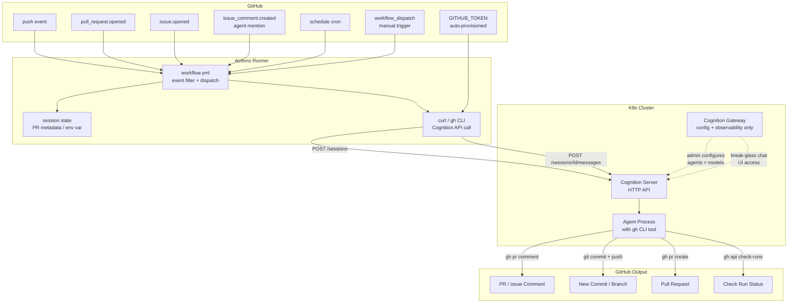
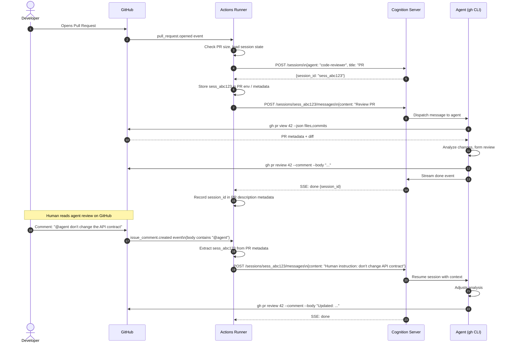
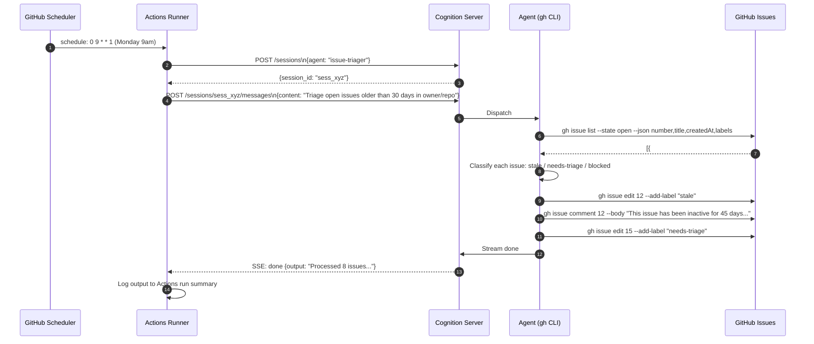
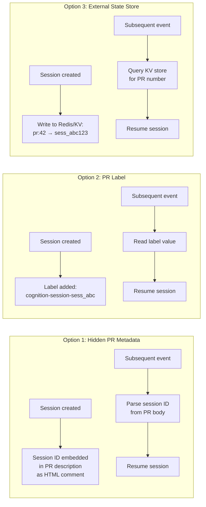
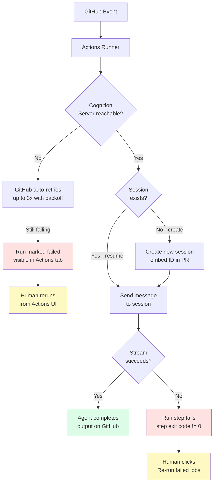

# RFC: GitHub-Driven Agent Orchestration via GitHub Actions → Cognition Server (Direct)

**Category:** Architecture / Orchestration
**Status:** Proposal — open for discussion
**Related:** [Option B: Gateway Webhook Orchestration](./gateway-webhook-orchestration.md)

---

## Overview

This discussion proposes using **GitHub Actions as the primary orchestration layer** for triggering autonomous agents against GitHub projects. The Cognition server is called directly from Actions runners — Cognition Gateway is used only as a configuration UI and break-glass observability tool, not as the event router.

The core premise: GitHub already has a best-in-class event bus, scheduling system, secret management, and audit trail. For agent workflows that are *about* GitHub (issues, PRs, discussions, Actions), using GitHub as the orchestrator is architecturally coherent and avoids unnecessary infrastructure.

---

## Architecture



---

## Sequence: PR Review Flow



---

## Sequence: Stale Issue Sweep (Scheduled)



---

## Workflow File Structure

Each repository (or a central "ops" repo managing multiple repos) contains:

```
.github/
  workflows/
    agent-pr-review.yml        # Triggers on pull_request events
    agent-issue-triage.yml     # Triggers on issues + schedule
    agent-comment-dispatch.yml # Triggers on @agent mentions in comments
    agent-ci-troubleshoot.yml  # Triggers on workflow_run failure
```

### Example: PR Review Workflow

```yaml
name: Agent PR Review

on:
  pull_request:
    types: [opened, synchronize]
  issue_comment:
    types: [created]

jobs:
  agent-review:
    # Only run on PR comments containing "@agent"
    if: |
      github.event_name == 'pull_request' ||
      (github.event_name == 'issue_comment' &&
       github.event.issue.pull_request &&
       contains(github.event.comment.body, '@agent'))

    runs-on: ubuntu-latest
    permissions:
      pull-requests: write
      issues: write
      contents: read

    steps:
      - name: Resolve session ID
        id: session
        env:
          GH_TOKEN: ${{ secrets.GITHUB_TOKEN }}
          PR_NUMBER: ${{ github.event.pull_request.number || github.event.issue.number }}
        run: |
          # Look for existing session ID in PR body metadata
          SESSION_ID=$(gh pr view $PR_NUMBER --json body -q '.body' | \
            grep -oP '(?<=<!-- cognition-session: )[\w]+(?= -->)' || echo "")
          echo "session_id=$SESSION_ID" >> $GITHUB_OUTPUT

      - name: Create or resume session
        id: cognition
        env:
          COGNITION_URL: ${{ secrets.COGNITION_SERVER_URL }}
          COGNITION_API_KEY: ${{ secrets.COGNITION_API_KEY }}
          SESSION_ID: ${{ steps.session.outputs.session_id }}
          PR_NUMBER: ${{ github.event.pull_request.number || github.event.issue.number }}
        run: |
          if [ -z "$SESSION_ID" ]; then
            RESPONSE=$(curl -sf -X POST "$COGNITION_URL/sessions" \
              -H "Authorization: Bearer $COGNITION_API_KEY" \
              -H "Content-Type: application/json" \
              -d "{\"title\": \"PR #$PR_NUMBER review\", \"agent_name\": \"code-reviewer\"}")
            SESSION_ID=$(echo $RESPONSE | jq -r '.id')
            # Embed session ID into PR description as hidden metadata
            gh pr edit $PR_NUMBER --body "$(gh pr view $PR_NUMBER --json body -q '.body')
          <!-- cognition-session: $SESSION_ID -->"
          fi
          echo "session_id=$SESSION_ID" >> $GITHUB_OUTPUT

      - name: Dispatch to agent
        env:
          COGNITION_URL: ${{ secrets.COGNITION_SERVER_URL }}
          COGNITION_API_KEY: ${{ secrets.COGNITION_API_KEY }}
          SESSION_ID: ${{ steps.cognition.outputs.session_id }}
          EVENT_TYPE: ${{ github.event_name }}
          COMMENT_BODY: ${{ github.event.comment.body }}
          PR_NUMBER: ${{ github.event.pull_request.number || github.event.issue.number }}
          REPO: ${{ github.repository }}
          GH_TOKEN: ${{ secrets.GITHUB_TOKEN }}
        run: |
          if [ "$EVENT_TYPE" == "pull_request" ]; then
            PROMPT="Review pull request #$PR_NUMBER in $REPO. Analyze the diff, identify issues, and post a detailed review comment."
          else
            PROMPT="Human instruction on PR #$PR_NUMBER: $COMMENT_BODY. Respond and update your review accordingly."
          fi

          # Stream the response (agent uses GITHUB_TOKEN env for gh CLI calls)
          curl -sf -X POST "$COGNITION_URL/sessions/$SESSION_ID/messages" \
            -H "Authorization: Bearer $COGNITION_API_KEY" \
            -H "Content-Type: application/json" \
            -H "Accept: text/event-stream" \
            -d "{\"content\": \"$PROMPT\"}" | \
            grep "^data:" | jq -r '.output // empty' | tail -1
```

---

## Session Continuity Strategy

The central challenge with GitHub Actions is maintaining conversational context across multiple events on the same PR or issue. Three approaches:



**Recommended: Option 1 (Hidden PR Metadata)**
- No external infrastructure needed
- Self-contained per PR
- Survives Gateway restarts
- Readable by anyone with PR access

---

## Failure Modes and Recovery



Key recovery properties:
- **GitHub retries failed webhook deliveries** up to 3 times automatically
- **Failed runs are permanent and rerunnable** from the Actions tab — nothing is lost
- **`workflow_dispatch`** allows manual re-triggering of any workflow on any ref
- **Partial failures** are visible step-by-step in the Actions UI

---

## Pros and Cons

### Advantages

| Advantage | Why It Matters |
|---|---|
| **No infrastructure to own for the trigger layer** | GitHub handles event routing, queuing, and retry — not you |
| **Native `GITHUB_TOKEN`** | Auto-provisioned per run, scoped to the repo, no PAT rotation |
| **Richest event model** | 40+ event types with fine-grained filters impossible to replicate with webhooks |
| **Built-in secret management** | Repo and org secrets encrypted at rest, never exposed in logs |
| **Failure is first-class** | Failed runs are visible, searchable, rerunnable from the GitHub UI |
| **No cold-path dependency** | Gateway can be down; agents still run |
| **Per-repo autonomy** | Each repo controls its own agent triggers via checked-in YAML |
| **`workflow_dispatch`** | Manual triggers with custom inputs — no UI needed for one-off runs |

### Disadvantages

| Disadvantage | Mitigation |
|---|---|
| **Minutes cap** (2,000 free / 3,000 Pro per month) | Self-hosted runners eliminate this; or keep runs short and stateless |
| **~15–30s cold start per event** | Acceptable for async workflows; not suitable for latency-sensitive use |
| **Config sprawl across repos** | Central "ops" repo with reusable workflows called via `workflow_call` |
| **No centralized agent activity dashboard** | Gateway serves as the observability layer (break-glass UI) |
| **Session continuity requires a convention** | Hidden PR metadata convention is lightweight but fragile if PR body is edited |
| **Cognition server must be internet-reachable** | VPN + self-hosted runners as alternative |
| **Workflow YAML in every repo** | Reusable workflow in a central repo, called from thin stubs |

---

## When to Use This Approach

**This is the right choice when:**

- You are the primary user (or a small team) — no need for multi-user auth on the orchestration layer
- You want agents to feel native to GitHub — activity shows up in PRs, Actions runs, and the GitHub notification stream
- You want maximum event fidelity — `pull_request.labeled`, `check_suite.rerequested`, `discussion.answered`, etc.
- You want GitHub to be the source of truth for what ran, when, and why
- You want zero additional infrastructure beyond the Cognition server

**This is the wrong choice when:**

- You need agents to run on events outside GitHub (internal Slack messages, monitoring alerts, etc.)
- You need a human to have a multi-turn conversation *before* the agent acts (Gateway chat UI is better)
- You need centralized cross-repo dashboards
- Actions minutes are a hard constraint

---

## Open Questions

1. **Self-hosted runners**: If the Cognition server is not internet-accessible, self-hosted runners in the same k8s cluster would be needed. Is that acceptable operational overhead?

2. **Session continuity durability**: Hidden PR metadata works but can be accidentally deleted by a PR body edit. Is that acceptable, or should a lightweight external KV (Redis sidecar) be used instead?

3. **Multi-repo vs. central ops repo**: Should each repo carry its own `agent-*.yml` workflows, or should a central "ops" repo serve as the agent control plane with `workflow_call` dispatchers in each target repo?

4. **Gateway role**: In this model, Gateway is used for initial agent/skill/model configuration, and as a break-glass UI when you want to debug a session interactively. Is that a sufficient justification to keep Gateway deployed, or is direct Cognition server API access sufficient?

---

## Related Discussion

See [Option B: Gateway Webhook Orchestration](./gateway-webhook-orchestration.md) for the alternative where Cognition Gateway serves as the primary event router and human-in-the-loop control plane, with GitHub webhooks as the trigger mechanism.
