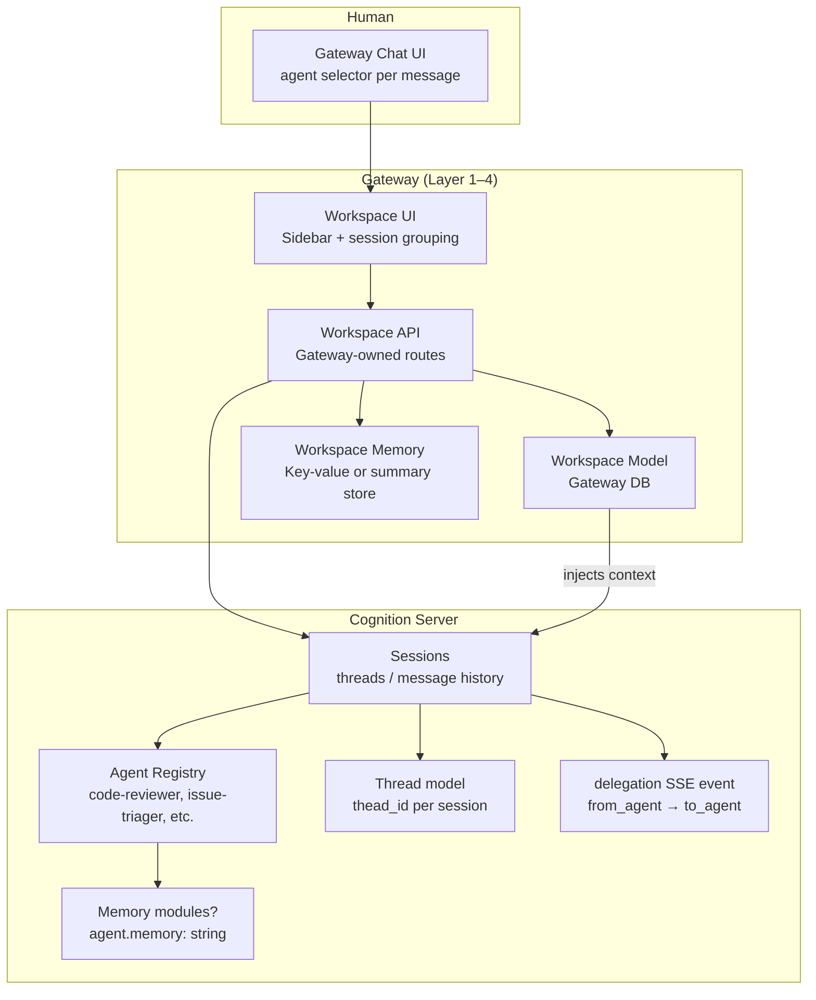
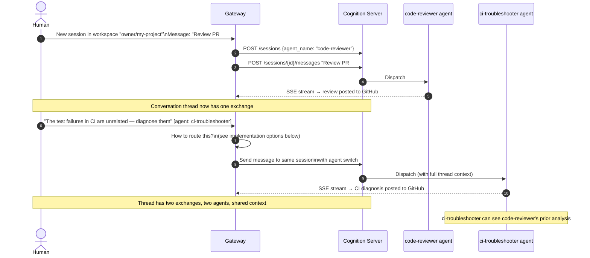
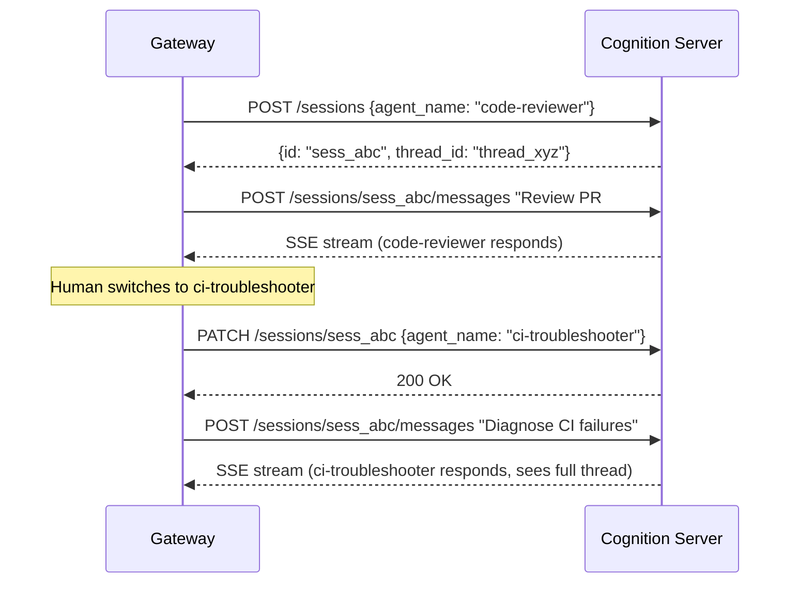
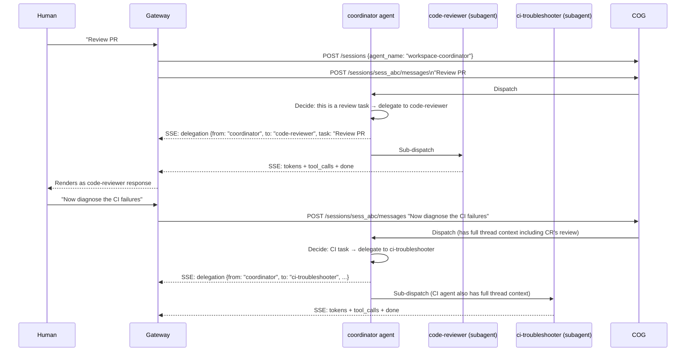
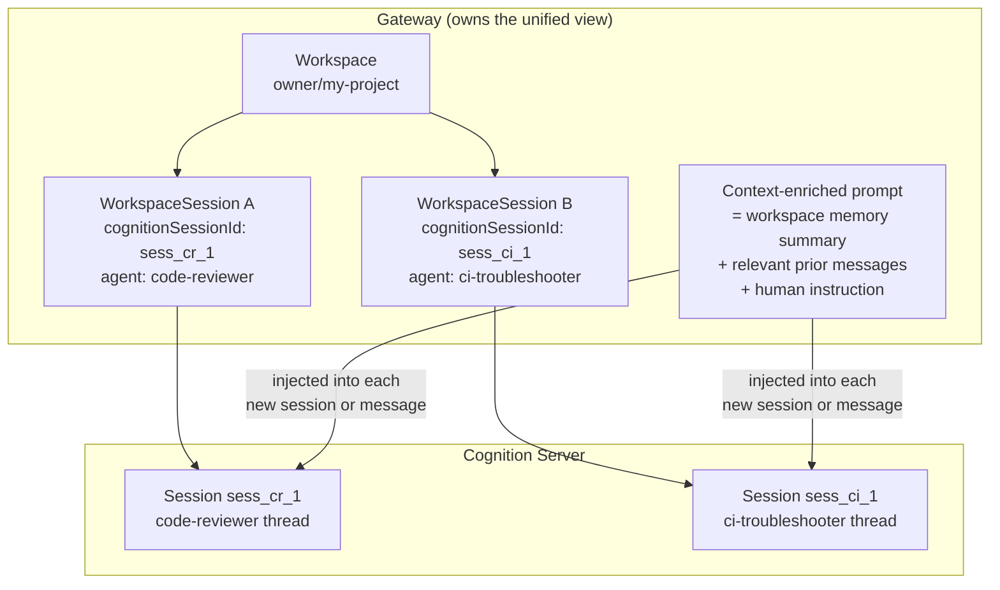
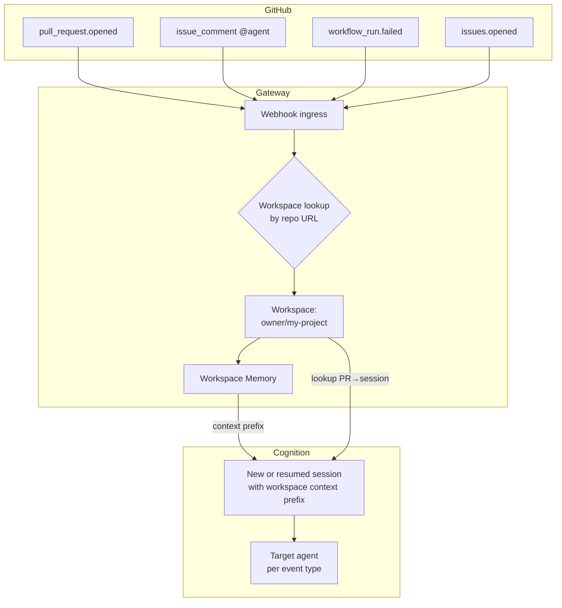
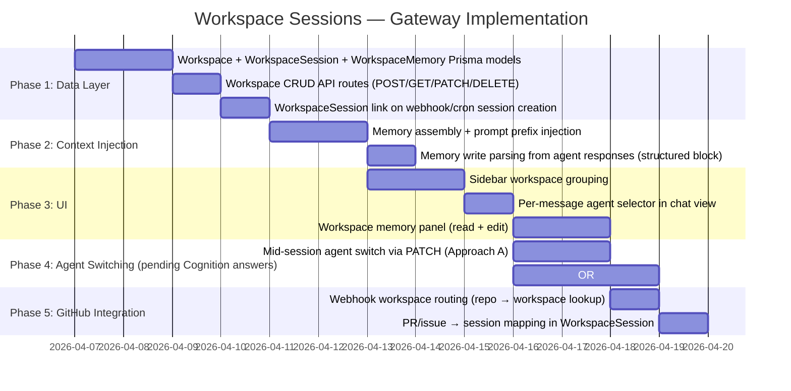

# RFC: Workspace Sessions — Agent-Fluid Conversations with Shared Context

**Category:** Architecture / Feature Design
**Status:** Proposal — open for discussion with Cognition server team
**Layer:** 1 (Data), 3 (API), 4 (UI)
**Related:**
- [Option A: GitHub Actions Direct to Cognition](./github-actions-direct-to-cognition.md)
- [Option B: Gateway Webhook Orchestration](./gateway-webhook-orchestration.md)

---

## Summary

Today, a Gateway session is a conversation locked to a single agent. This RFC proposes a **Workspace** as a first-class concept that groups sessions under a shared context, and allows different agents to be invoked message-by-message within a single session — without losing conversational thread or memory.

The motivating scenario is GitHub project orchestration: a code-reviewer agent, an issue-triager agent, and a ci-troubleshooter agent should all operate with awareness of what the others have done within the same project context. A human should be able to steer any of them from a single interface, switching agents mid-conversation the way a manager hands off tasks to specialists in the same team room.

---

## Problem Statement

### Current model

```
Session ──── agent_name (fixed at creation)
         └── messages (isolated from all other sessions)
```

Each session is a siloed conversation with one agent. There is no shared state between sessions, no concept of a "project" or "repository" grouping, and no way for one agent to know what another agent observed or produced.

### The consequence

An autonomous agent workflow against a GitHub repository involves many agent runs across many events: PR opens, CI fails, issues age out, a human intervenes. Each of these creates an independent Cognition session. The agents cannot build on each other's work. The human has no unified view. The code-reviewer's insight that `src/parser.ts` is fragile is invisible to the CI troubleshooter that runs three hours later on a failing test in the same file.

### What we want

```
Workspace: owner/my-project
    ├── shared memory / context
    ├── Session A: "PR #42"
    │   ├── [code-reviewer]  → posted review
    │   ├── [human]          → "ignore API changes, focus on tests"
    │   └── [code-reviewer]  → updated review
    └── Session B: "Issue #18"
        ├── [issue-triager]  → labeled + commented
        └── [ci-troubleshooter] → linked to PR #42 root cause
```

Every agent in the workspace can access accumulated context. The human has one place to see all activity and one interface to intervene.

---

## Proposed Architecture

### Layer overview



---

## Workspace Model

### Gateway DB schema (proposed)

```prisma
model Workspace {
  id          String    @id @default(cuid())
  name        String
  description String?
  slug        String    @unique  // e.g. "owner-my-project"
  metadata    String?   // JSON: { repoUrl, repoOwner, repoName }
  userId      String
  user        User      @relation(fields: [userId], references: [id])
  createdAt   DateTime  @default(now())
  updatedAt   DateTime  @updatedAt

  sessions    WorkspaceSession[]
  memory      WorkspaceMemory[]
}

model WorkspaceSession {
  id              String    @id @default(cuid())
  workspaceId     String
  workspace       Workspace @relation(fields: [workspaceId], references: [id])
  cognitionSessionId String  // the session ID on the Cognition server
  title           String?
  trigger         String?   // "manual" | "webhook" | "cron"
  triggerRef      String?   // PR number, issue number, run ID, etc.
  createdAt       DateTime  @default(now())
  updatedAt       DateTime  @updatedAt
}

model WorkspaceMemory {
  id          String    @id @default(cuid())
  workspaceId String
  workspace   Workspace @relation(fields: [workspaceId], references: [id])
  key         String    // e.g. "fragile_files", "open_issues", "ci_flakiness"
  value       String    // text summary or JSON
  source      String    // "agent" | "human" | "system"
  sessionId   String?   // which session produced this memory
  agentName   String?   // which agent wrote it
  createdAt   DateTime  @default(now())
  updatedAt   DateTime  @updatedAt

  @@index([workspaceId])
}
```

### What this enables

- Group any number of Cognition sessions under one workspace
- Track how each session was triggered (webhook from PR #42, cron sweep, human manual)
- Store durable key-value memory that persists across sessions
- Link memory entries back to the session and agent that produced them

---

## Agent-Fluid Sessions

### The proposal

Within a workspace session, the human (or the automation layer) can target a different agent per message. The conversation thread is continuous — all messages, from all agents, are part of the same history.



### The key open question

Does the Cognition server support **mid-session agent switching with thread continuity**?

There are three possible implementation paths, each with different Cognition server requirements:

---

## Implementation Approaches

### Approach A: Gateway PATCHes `agent_name` per message

Before each message, Gateway calls `PATCH /sessions/{id}` with the new `agent_name`. The next message is processed by the new agent against the existing thread.



**This is the simplest approach** — it uses existing API surface (`SessionUpdate.agent_name` already exists in the type definitions). Gateway has full control.

**What we need to know from Cognition devs:**
- When `agent_name` is changed mid-session, does the new agent receive the full prior message history in its context window?
- Does the agent's system prompt, tools, and skills load fresh on the next message after the PATCH?
- Is there a race condition if a message is in-flight when the PATCH arrives?
- Does the Cognition server validate that the new `agent_name` exists before accepting the PATCH?

---

### Approach B: Coordinator agent with delegation

Gateway creates one session with a special "workspace coordinator" agent. Human messages include an `@agent-name` mention. The coordinator delegates to the target agent, emitting `delegation` SSE events. The thread remains continuous and single-agent from the server's perspective.



**This is the most "native" approach** — it uses the existing `delegation` SSE event and treats sub-agents as first-class. The coordinator pattern is common in multi-agent systems.

**What we need to know from Cognition devs:**
- Does the `delegation` SSE event represent an actual sub-agent call where the sub-agent receives the parent session's thread history?
- Can sub-agents (mode: `"subagent"`) be called directly within a session, or does delegation require the coordinator to explicitly pass context?
- Is there a native "coordinator" agent type, or does this require a custom agent with a delegation-aware system prompt?
- Do delegated sub-agents have access to the same tools as the coordinator, or only their own registered tools?
- What happens to the thread history after delegation — do sub-agent messages appear in the session's message list?

---

### Approach C: Gateway manages routing, Cognition sees independent sessions

Each agent invocation is a separate Cognition session. Gateway owns the unified thread view by assembling messages from all sessions in the workspace. When invoking a new agent, Gateway constructs a context-enriched prompt that includes a summary of prior agent activity.



**This is the most Gateway-independent approach** — no Cognition server changes required. Gateway assembles cross-session context and injects it.

**Limitations:**
- Context injection grows unbounded as the workspace accumulates history
- No true thread continuity — each agent always starts fresh with an injected summary
- Agents cannot interactively reference each other's tool outputs or reasoning steps, only summarized text
- More prompt engineering overhead

**What we need to know from Cognition devs:**
- Is there a token budget or message limit per session that would constrain how much injected context is practical?
- Does the Cognition server support a `system_prompt` override per session (already in `SessionConfig.system_prompt`) that could carry workspace context?
- Is there a recommended pattern for providing external context to an agent without it being treated as a user message?

---

## Workspace Memory Model

Workspace memory is a persistent, writable store that agents and humans contribute to across sessions. It serves as the "institutional knowledge" of the workspace.

```mermaid
flowchart LR
    subgraph "Memory Sources"
        A1[Agent writes: "src/parser.ts flagged for null check"]
        A2[Agent writes: "CI flaky tests in api/ directory"]
        A3[Human writes: "Do not modify the public API surface"]
        A4[System: "PR #42 reviewed — approved by human 03/18"]
    end

    subgraph "Memory Store (Gateway DB)"
        MEM[(WorkspaceMemory\nkey-value + source + agent)]
    end

    subgraph "Memory Consumers"
        B1[Next agent session:\nreceives memory as context prefix]
        B2[Human chat UI:\nviewable / editable memory panel]
        B3[Cron sweep agent:\nknows recent activity before starting]
    end

    A1 --> MEM
    A2 --> MEM
    A3 --> MEM
    A4 --> MEM
    MEM --> B1
    MEM --> B2
    MEM --> B3
```

### Two memory strategies

**Strategy 1: Gateway-managed (no Cognition server changes)**

Gateway owns the `WorkspaceMemory` table. Before each session or message, Gateway prepends a formatted memory summary to the prompt:

```
== Workspace Context: owner/my-project ==
- src/parser.ts has a known null dereference risk (flagged by code-reviewer, PR #42, 2026-03-18)
- CI flaky tests exist in api/ directory (diagnosed by ci-troubleshooter, run #99)
- Human constraint: do not modify public API surface
== End Context ==

[Human instruction]: Review PR #43 for test coverage gaps.
```

Agents write to workspace memory by including a structured block in their response that Gateway parses and stores:

```
<!-- workspace-memory
key: new_finding
value: PR #43 introduces 3 new API endpoints with no corresponding tests
-->
```

Gateway strips this block from the displayed response and persists it to `WorkspaceMemory`.

**Strategy 2: Cognition-managed memory modules (requires server support)**

If the Cognition server's `memory: string[]` field on `AgentCreate` refers to a pluggable memory backend (e.g., a LangChain memory module, a vector store, or a persistent thread store), agents could read and write workspace memory natively — without Gateway parsing responses.

This would require:
- A shared memory namespace/scope concept on the Cognition server (e.g., `memory_scope: "workspace:owner/my-project"`)
- Agents in the same workspace share the same memory namespace
- Memory is persisted and retrievable across sessions without Gateway involvement

---

## UI Design

### Sidebar: workspace-grouped sessions

```
┌──────────────────────────────────┐
│  + New Workspace                 │
├──────────────────────────────────┤
│  ▼ owner/my-project              │
│    ● PR #42 Review         [CR]  │
│    ● Issue #18 Triage      [IT]  │
│    ○ Weekly Sweep 03/17    [IT]  │
│    + New session here            │
├──────────────────────────────────┤
│  ▶ owner/other-repo              │
├──────────────────────────────────┤
│  Ungrouped sessions              │
│    ○ Untitled chat               │
└──────────────────────────────────┘
```

- Agent initials shown per session (`[CR]` = code-reviewer, `[IT]` = issue-triager)
- Active session shown with filled dot
- Workspaces collapsible
- Ungrouped sessions remain for backward compatibility

### Chat view: per-message agent selector

```
┌─────────────────────────────────────────────────────────────────┐
│ code-reviewer                                          03/18 14:22│
│ ─────────────────────────────────────────────────────────────── │
│ Reviewed PR #42. Found 3 issues: missing null check in           │
│ parser.ts:44, untested edge case in auth.ts:102, and a           │
│ performance regression in the batch query path.                  │
│                                                                   │
│ ▶ Tool calls (4)   ▶ Planning (3 steps)                          │
├─────────────────────────────────────────────────────────────────┤
│ You                                                    03/18 14:25│
│ ─────────────────────────────────────────────────────────────── │
│ Ignore the performance regression — that's intentional.          │
│ Check if the CI failures are related to the null check.          │
├─────────────────────────────────────────────────────────────────┤
│ ci-troubleshooter                                      03/18 14:26│
│ ─────────────────────────────────────────────────────────────── │
│ Checked CI run #99. The failure in api/parser.test.ts is         │
│ directly related — test expects the method to throw but          │
│ the null dereference happens before the throw guard.             │
└─────────────────────────────────────────────────────────────────┘

┌──────────────────────────────────────────────────────┐
│ [ci-troubleshooter ▾]  Type a message...       [Send] │
└──────────────────────────────────────────────────────┘
```

Agent chips in message bubbles show which agent produced each response.
The input bar carries the last-used agent and lets the human switch before sending.

### Workspace memory panel

A collapsible side panel (analogous to the Task Canvas) shows the workspace memory:

```
┌──────────────────────────────────┐
│  Workspace Memory                │
│  owner/my-project         [Edit] │
├──────────────────────────────────┤
│  ⚙ src/parser.ts is fragile      │
│    code-reviewer · PR #42        │
│                                  │
│  ⚙ CI flaky tests in api/        │
│    ci-troubleshooter · run #99   │
│                                  │
│  👤 Do not change public API     │
│    human · manual entry          │
├──────────────────────────────────┤
│  + Add memory entry              │
└──────────────────────────────────┘
```

Humans can manually add, edit, or delete memory entries. Agent-written entries are visually distinguished from human-written ones.

---

## GitHub Integration Mapping

With workspaces, the GitHub orchestration use cases from the companion RFCs map cleanly:



**Event-to-workspace routing:**
Each Gateway webhook is associated with a workspace (by repo slug). When a webhook fires:
1. Gateway looks up the workspace for `owner/repo`
2. Assembles the workspace memory as context
3. Checks if an existing workspace session exists for this PR/issue (session continuity)
4. Creates or resumes the Cognition session with workspace context injected
5. Routes to the appropriate agent for the event type

This is a significant upgrade from the current webhook model — the agent arrives with accumulated project knowledge on every run, not a blank slate.

---

## Open Questions for Cognition Server Developers

The following questions determine which implementation approach is viable and what server-side changes, if any, are needed. They are organized from most to least fundamental.

---

### I. Thread and Session Model

**Q1. When `PATCH /sessions/{id}` changes `agent_name`, does the new agent receive the full prior message history on the next `POST /sessions/{id}/messages`?**

This is the foundational question for Approach A (mid-session agent switching). If the answer is yes, Approach A works today with no server changes. If no, we need to understand why and whether it could be supported.

- Does the Cognition server load the full `thread_id` history and inject it into the new agent's context?
- Or does each agent only see messages from its own agent runs?

---

**Q2. What is the relationship between `session_id` and `thread_id`?**

`SessionSummary` exposes both. Gateway currently ignores `thread_id`. Understanding this relationship is critical for cross-session context.

- Is `thread_id` stable across agent switches within a session?
- Can two sessions share the same `thread_id`? (i.e., could a "workspace thread" exist independently of sessions?)
- Is `thread_id` a LangGraph checkpoint thread ID? If so, can it be pre-seeded with a summary or messages?

---

**Q3. Is there a concept of a "shared thread" or "parent context" that multiple sessions can reference?**

This would enable Approach A/B natively — a workspace-scoped thread that all sessions in the workspace are children of.

- Could we create a "workspace thread" with `POST /threads` (hypothetical) and pass `thread_id` at session creation?
- Or pass `parent_session_id` to inherit context?

---

**Q4. What happens to the `delegation` SSE event — does the sub-agent receive the parent session's thread history?**

The `delegation` event (`from_agent`, `to_agent`, `task`) is already in the protocol. We'd like to understand its current semantics.

- When the coordinator delegates to a sub-agent, does the sub-agent receive the full parent thread as context?
- Or does delegation only pass the `task` string, and the sub-agent starts cold?
- Can delegation be triggered explicitly by a message (e.g., "delegate this to ci-troubleshooter") or only by the agent's own reasoning?

---

**Q5. What is the maximum practical thread length (in messages or tokens) before context truncation occurs?**

For long-running workspace sessions with many agent turns, we need to understand truncation behavior.

- Does the Cognition server truncate older messages when approaching the model's context window?
- Is there a configurable `max_messages` or `max_context_tokens` per session?
- Does `recursion_limit` in `SessionConfig` relate to this?

---

### II. Memory Modules

**Q6. What does `memory: string[]` in `AgentCreate` and `AgentUpdate` actually refer to?**

This is the most opaque field in the current type definitions. The array of strings suggests memory module identifiers.

- What memory backends are supported? (e.g., `"in_memory"`, `"redis"`, `"postgres"`, `"vector_store"`, custom?)
- Is memory persistent across sessions for the same agent?
- Is memory scoped per-agent, per-user, or globally?
- Can memory be namespaced? (e.g., all agents in a workspace sharing `"workspace:owner/my-project"`)

---

**Q7. Can multiple agents share a memory namespace?**

This is the core question for workspace memory.

- If two agents both have `memory: ["workspace_store"]`, do they read and write to the same store?
- Can agents query the memory store during a session (e.g., "what does the workspace memory say about parser.ts")?
- Can agents write to memory explicitly (e.g., via a `memory_write` tool call)?

---

**Q8. Is there a memory read/write tool available to agents?**

The `ToolInfo` type suggests tools are registered on the server. Is there a native memory tool?

- Is there a `memory_read` / `memory_write` tool that agents can call?
- Or is memory handled implicitly by the LangGraph checkpoint mechanism?
- If we wanted to expose workspace memory to an agent, is injecting it into the `system_prompt` at session creation the recommended approach?

---

### III. Multi-Agent Coordination

**Q9. What is the recommended pattern for building a coordinator agent that routes to specialists?**

The `delegation` SSE event implies some form of coordinator support exists. We want to understand the intended design.

- Is there a built-in coordinator agent type, or does coordination require a custom agent with a delegation-aware system prompt?
- What tools does the coordinator need to invoke sub-agents? Is there a `delegate_to_agent(agent_name, task)` tool?
- Is the coordinator pattern documented anywhere internally?

---

**Q10. Can an agent be configured to be both `primary` and a coordinator — i.e., visible to users but also able to orchestrate sub-agents?**

Current `AgentResponse.mode` values are `"primary"`, `"subagent"`, `"all"`. Gateway is interested in a workspace coordinator that the human can directly address but which also routes internally.

- Does `mode: "all"` serve this purpose?
- Are there constraints on which agents can invoke other agents?

---

**Q11. When a sub-agent is delegated a task, can it use a different LLM provider or model than the parent?**

For cost optimization: the coordinator might use a large model for reasoning, while specialist sub-agents use smaller models for well-defined tasks.

- Does each agent's `model` and `temperature` apply independently to its own invocations?
- Or does the parent session's `SessionConfig` (provider, model) override all agents in the session?

---

### IV. Scoping and Multi-Tenancy

**Q12. Can scope (`x-cognition-scope-user`) be set to a workspace identifier instead of (or in addition to) a user ID?**

Currently, Gateway injects `x-cognition-scope-user: {userId}` on every proxied request. For workspace sessions, we'd want sessions to be scoped to a workspace (e.g., `x-cognition-scope-workspace: workspace_abc`) so they are discoverable by any user in the workspace, not just the creating user.

- Does the server support scoping by arbitrary string keys, or only by user?
- Can a session have multiple scope dimensions? (user + workspace)
- What does `ConfigResponse.server.scoping_enabled` control exactly?

---

**Q13. What does `scope: Record<string, string>` on `AgentCreate`, `SkillCreate`, and `ProviderCreate` mean at runtime?**

These scope fields are in the type definitions but Gateway does not currently use them for anything beyond pass-through.

- What are the expected keys and values? (e.g., `{ user_id: "user_123" }`, or `{ workspace: "owner/my-project" }`)
- Does scope affect which sessions can use the agent, or only which users can see it in `GET /agents`?
- Can scope be used to create workspace-specific agents that override global agents?

---

### V. API Surface Gaps

**Q14. Is there (or could there be) an endpoint to list sessions by thread ancestry or shared context?**

For Approach A to work well in the UI, Gateway needs to be able to list all sessions that share a workspace context — not just sessions belonging to the authenticated user.

- Could `GET /sessions?thread_id={id}` or `GET /sessions?context_id={id}` be supported?
- Or would this be unnecessary if workspace-scoped sessions are supported natively (Q12)?

---

**Q15. Is there a `POST /sessions/{id}/messages` parameter for injecting system-level context that is NOT visible as a user turn in the thread?**

For workspace context injection, Gateway would ideally prepend workspace memory to the agent's context without it appearing as a "user message" in the conversation history (which would look odd in the UI).

- Is `MessageCreate` the only way to add context, or is there a `context` or `system_injection` field?
- Could `SessionConfig.system_prompt` be patched per-message to carry ephemeral context?
- Or is a `role: "system"` message type supported in the message POST body?

---

**Q16. Is there a `/sessions/{id}/checkpoint` or `/sessions/{id}/summary` endpoint?**

For long workspace sessions, Gateway may need to summarize prior context rather than passing the full thread. A server-side summarization endpoint would be cleaner than Gateway doing this itself.

- Does the server support generating a summary of a session's thread?
- Or would this be a tool call that an agent performs explicitly?

---

## Implementation Roadmap (Gateway-side)

Ordered by dependency and risk, assuming Cognition server answers determine which approach is taken:



**Phase 1 and 2** can start immediately — they require only Gateway DB changes and prompt engineering, with no Cognition server dependency. **Phase 4** is blocked on answers to Q1–Q5 above.

---

## Definition of Done

Per AGENTS.md, this is a **Feature** (Layer 1–4, architectural change). DoD:

- [ ] Listed in ROADMAP.md with acceptance criteria before work begins
- [ ] `Workspace`, `WorkspaceSession`, `WorkspaceMemory` models in Prisma schema
- [ ] Workspace CRUD API routes with Zod validation and auth-gating
- [ ] Workspace context injected into cron and webhook session prompts
- [ ] Sidebar shows workspace-grouped sessions
- [ ] Per-message agent selector functional in chat view (not cosmetic)
- [ ] Workspace memory panel visible and editable
- [ ] Agent switching tested against Cognition server (approach confirmed by answers to Q1–Q5)
- [ ] Backward compatible: ungrouped sessions continue to work
- [ ] Layer boundaries respected (no browser imports of `src/lib/gateway/`)
- [ ] Unit tests for workspace context assembly and memory parsing
- [ ] Integration tests for workspace CRUD API
- [ ] `src/lib/gateway/` remains extractable (no React/Next.js imports)

---

## Summary for Cognition Developers

This RFC is asking Cognition server developers to answer 16 questions grouped into five areas:

| Area | Questions | Impact |
|---|---|---|
| Thread & session model | Q1–Q5 | Determines whether mid-session agent switching (Approach A) is viable without server changes |
| Memory modules | Q6–Q8 | Determines whether workspace memory can live natively on the server vs. being managed by Gateway |
| Multi-agent coordination | Q9–Q11 | Determines whether a coordinator agent (Approach B) is buildable with current agent primitives |
| Scoping & multi-tenancy | Q12–Q13 | Determines whether workspace-scoped sessions are natively supportable |
| API surface gaps | Q14–Q16 | Identifies missing endpoints that would make Gateway workspace integration significantly cleaner |

**None of the questions assume that changes are required.** Several of the desired behaviors may already work and simply need confirmation. The goal is to avoid building a Gateway-owned workaround for something the Cognition server already handles natively.
